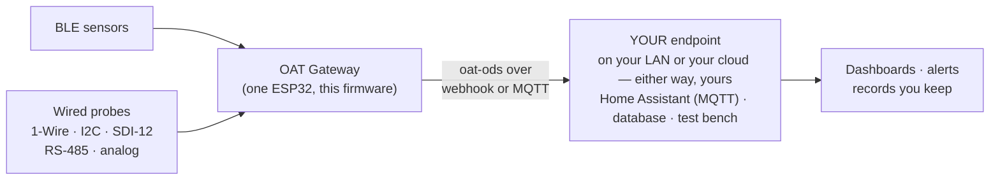

<p align="center">
  
</p>

<p align="center"><em><a href="https://openagriculturetechnology.com/">Open Agriculture Technology</a> is an open collective around one idea:<br>
appropriate technology for growing things — the right tool for the need, the budget, and the environment.</em></p>

<h1 align="center">The OAT Sketch Library</h1>

<p align="center"><strong>ESP32 firmware that reads your sensors and lands every measurement somewhere <em>you</em> own.</strong><br>
No cloud account. No subscription. No lock-in. Your data goes where you point it.<br>
The firmware arm of the OAT system: the <a href="https://openagriculturetechnology.com/">Library</a> teaches it, the
<a href="https://openagriculturetechnology.com/standard/">Standard</a> defines the envelope, these sketches put it on your bench.</p>

<p align="center">
  <a href="#licensing"></a>
  
  
  <a href="https://openagriculturetechnology.com/build/sketches/"></a>
</p>

---

Every sketch here does the same honest job: read a sensor, turn the reading into a
small self-describing message, and push it to an endpoint the grower chooses — a
webhook or an MQTT broker. That's the whole contract. The endpoint can be
[Home Assistant](https://openagriculturetechnology.com/home-assistant/), a
database on a Raspberry Pi, a spreadsheet-feeding script, or the
[free test endpoint](https://openagriculturetechnology.com/standard/test-endpoint/)
where you can watch your first reading arrive — or a receiver you run yourself,
in one command, from this repo's [`endpoint/`](endpoint/) directory.



<p align="center"></p>

The message format is [**oat-ods**](https://openagriculturetechnology.com/standard/) —
one JSON envelope for every sensor, so your endpoint can't tell a $600 research
instrument from a $12 thermometer. It's all one stream of data you keep.

## The sketches

| Sketch | Reads | Interface | Status |
|---|---|---|---|
| [**BLE Sensor Listener**](oat-ble-listener/) | Govee-class Bluetooth sensors — temperature, humidity, soil, CO₂, and ~120 device types | BLE (no wiring) | **Live** — [flash from the browser](https://openagriculturetechnology.com/build/sketches/ble-sensor-listener/) |
| [**SHT-30 Node**](oat-sht30-node/) | Accurate air temperature + humidity, one or two sensors per board | I²C | **Live** — [flash from the browser](https://openagriculturetechnology.com/build/sketches/sht30-node/) |
| [**DS18B20 Node**](oat-ds18b20-node/) | Sealed temperature probes, up to ten on a single wire | 1-Wire | **Live** — [flash from the browser](https://openagriculturetechnology.com/build/sketches/ds18b20-node/) |
| [**SDI-12 Reader**](oat-sdi12-reader/) | Research-grade soil, water and weather instruments (Apogee, METER, Acclima…) | SDI-12 bus | Source — build & flash |
| [**Modbus / RS-485 Reader**](oat-modbus-reader/) | Industrial Modbus RTU sensors, multi-drop over long runs | RS-485 | Source — build & flash |
| [**Analog & 4–20 mA Reader**](oat-analog-reader/) | The huge install base of analog and current-loop sensors | ADS1115 (I²C) | Source — build & flash |
| [**CWSI Node**](oat-cwsi-node/) | Canopy temperature — the earliest water-stress signal — with a no-contact IR eye | MLX90614 (I²C) | Source — build & flash |
| [**Load-Cell Watering Node**](oat-loadcell-water/) | Pot weight and water use, plus a local weigh-and-water loop | HX711 | Source — build & flash |

**Status, honestly:** *Live* means compiled images are published and you can flash
from the browser on the site — no IDE, no command line. *Source* means the code is
complete and openly licensed, but you build it yourself (five minutes with
PlatformIO, below).

**Set up one OAT node and you have set up all of them.** The sketches share one
core: the same captive-portal setup page, the same Wi-Fi flow, the same push
engine (HTTPS-preferred, HMAC-signed, batched), the same 60-second health
heartbeat, the same two-way USB console. Only the sensor read differs.

## Quick start

**Live sketches — no toolchain at all:**

1. Open the sketch's page on the site (links above) in Chrome or Edge.
2. Plug in the ESP32 and click **Install** (ESP Web Tools, straight from the browser).
3. Join the node's own Wi-Fi (`OAT-…`), and its setup page walks you through
   Wi-Fi, delivery, and naming.
4. Point delivery at the [test endpoint](https://openagriculturetechnology.com/standard/test-endpoint/)
   and watch your first reading arrive.

**Source sketches — build it yourself:**

```bash
pipx install platformio          # or: pip install --user platformio
cd oat-sdi12-reader              # any sketch directory
./build.sh
```

Each sketch's `platformio.ini` pins its dependencies; `build.sh` produces one
merged, flash-at-offset-0 image per supported chip in `out/`.

## Prove it in two minutes — no hardware needed

The whole pipeline is testable from your terminal against OAT's live public
sandbox:

```bash
curl -s https://openagriculturetechnology.com/standard/samples/ods-batch.json -o batch.json
curl -s -X POST -H "Content-Type: application/json" --data-binary @batch.json \
  "https://openagriculturetechnology.com/standard/test-endpoint/ingest.php?box=YOUR-NAME"
```

The response is a conformance verdict (`"conformant":2`), and your readings are
waiting at `…/standard/test-endpoint/?box=YOUR-NAME`, parsed and raw. Then take
the next rung: run the same receiver yourself from
[`endpoint/`](endpoint/) — Python or Node, the same
contract as the sandbox. **Try ours → run ours → build your own.**

## What a reading looks like

Every measurement becomes one small record inside a signed batch — canonical
measurement names and SenML units from the
[shared vocabulary](https://openagriculturetechnology.com/standard/reference/),
with provenance down to the physical sensor:

```json
{
  "stream": "gh2-soil",
  "measurement": "soil_moisture",
  "value": 34.2,
  "unit": "%",
  "agg": { "window_s": 300, "samples": 10, "method": "mean" },
  "source": { "physical_id": "sdi12:0" }
}
```

Swap the probe and the stream's history carries on — the stream is the durable
identity, and the physical sensor is recorded per reading. The full contract —
batch envelope, field tables, a published
[JSON Schema](https://openagriculturetechnology.com/standard/oat-ods-0.3.schema.json),
sample payloads — lives in the
[developer reference](https://openagriculturetechnology.com/standard/reference/).

## Coming next

Listed so the library shows its shape — not yet written:
**915 MHz RF Listener** (Ecowitt/Fine Offset weather sensors via the rtl_433
device universe) · **LoRa Field Node + LoRa Bridge** (point-to-point, no network
server, no subscription) · **Soil-Moisture Node** (capacitive starter) ·
**Rule-Driven Relay** (the Control-side conversation, with fail-safe defaults
spelled out).

## Repository layout

```
oat-<sketch>/        one directory per sketch: .ino, platformio.ini, build.sh, README
endpoint/            the receiving half: runnable receivers (Python/Node) + schema + samples
lib/oat_ods/         the shared oat-ods encoder + measurand vocabulary
lib/oat_sign/        the shared HMAC push signer
lib/oat_node_core/   the shared node core (config, Wi-Fi, portal, push engine)
oat-node-template/   the starting point for a new sketch
docs/                images and shared documentation
```

## Licensing

- **Code:** [Apache-2.0](LICENSE) — use it, change it, sell what you build with it;
  keep the notice. **Exception:** `oat-ble-listener/` depends on
  [Theengs Decoder](https://decoder.theengs.io/) (GPL-family), so distributed
  binaries of that one sketch inherit GPL obligations — its README says so plainly.
- **Documentation and text:** [CC BY 4.0](https://creativecommons.org/licenses/by/4.0/) —
  credit "Open Agriculture Technology (openagriculturetechnology.com)".
- **The OAT name and logo** identify the project and aren't part of the code
  license — use them to refer to us, not to imply endorsement.

## Contributing

Contributions are welcome — fixes, new device decoders, whole new sketches on the
node template. By submitting, you agree your contribution is yours to give and is
licensed under this repository's terms (we may relicense reference implementations
for compatibility; you always keep your own rights to your own work). We're a
small crew: issues and pull requests get honest attention, not instant attention.

## About

OAT — [Open Agriculture Technology](https://openagriculturetechnology.com/) — is an
open collective around one idea: **appropriate technology** for growing things —
the right tool for the need, the budget, and the environment, spanning DIY and
commercial. The [Library](https://openagriculturetechnology.com/) teaches it, the
[Solution Store](https://openagriculturetechnology.com/store/) frames it around
real needs, and these sketches are the firmware half of the promise: **your
sensors, your data, somewhere you own.**

*An [OpenCDC](https://openagriculturetechnology.com/about/) initiative.*
