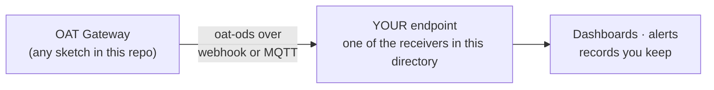

<p align="center">
  
</p>

<p align="center"><em><a href="https://openagriculturetechnology.com/">Open Agriculture Technology</a> is an open collective around one idea:<br>
appropriate technology for growing things — the right tool for the need, the budget, and the environment.</em></p>

<h1 align="center">Your Endpoint</h1>

<p align="center"><strong>Every OAT sketch pushes to an endpoint you own. This directory is that endpoint — runnable in Python or Node.</strong><br>
The receiving half of the <a href="../">OAT Sketch Library</a>: same open
<a href="https://openagriculturetechnology.com/standard/">oat-ods</a> envelope, now on the catching end.</p>

<p align="center">
  
  
  
  <a href="https://openagriculturetechnology.com/standard/reference/"></a>
</p>

---

An endpoint is just a small program that accepts what a gateway sends and keeps
it — on a Raspberry Pi, a spare machine, or a cloud box; either way, yours. The
trust ladder here has no gaps: **see ours live → prove yours talks → run a
receiver → build your own.**



## See one running

The **[Open Agriculture Technology Test Endpoint](https://iot-test.openagriculturetechnology.com/)**
is a live endpoint console with our own gateways pushing readings into it right
now — open it, no sign-in. It's the proof that everything below is real, and
the picture of what your own endpoint can grow into.

## Prove yours talks — two minutes in the sandbox

OAT also runs a **[conformance sandbox](https://openagriculturetechnology.com/standard/test-endpoint/)** —
free, public, no account needed. You don't even need hardware:

```bash
curl -s https://openagriculturetechnology.com/standard/samples/ods-batch.json -o batch.json
curl -s -X POST -H "Content-Type: application/json" --data-binary @batch.json \
  "https://openagriculturetechnology.com/standard/test-endpoint/ingest.php?box=YOUR-NAME"
```

The response is a conformance verdict:

```json
{"ok":true,"box":"YOUR-NAME","records":2,"stored":2,"conformant":2,"duplicate":false,"issues":[]}
```

Then open `https://openagriculturetechnology.com/standard/test-endpoint/?box=YOUR-NAME`
and your readings are sitting there — parsed fields beside the raw JSON. Run the
POST a second time and you'll get `"duplicate":true, "stored":0` — that's the
monotonic `seq` refusing a replay, which is the guard your own endpoint gets
below. (It's a shared sandbox: boxes are open by name and hold the last 50
readings, so pick a distinctive name and send nothing private.)

## Run ours — one command each

| Receiver | Stack | Run it |
|---|---|---|
| [`oat_ingest.py`](oat_ingest.py) | Python · Flask | `pip install flask` · set `OAT_INGEST_KEY` · `python3 oat_ingest.py` → `:8099` |
| [`oat_ingest.js`](oat_ingest.js) | Node · Express | `npm i express` · set `OAT_INGEST_KEY` · `node oat_ingest.js` → `:8099` |
| [`oat_ingest_mqtt.py`](oat_ingest_mqtt.py) | Python · paho-mqtt | `pip install paho-mqtt` · set `OAT_MQTT_HOST` · subscribes `oat/#` |
| [`oat_ingest_mqtt.js`](oat_ingest_mqtt.js) | Node · mqtt.js | `npm i mqtt` · set `OAT_MQTT_URL` · same behavior |

All four handle single messages and batches, verify the optional `oat1` HMAC
signature over the raw body, and reject replays by sequence number. Point any
sketch's delivery field at the machine running one, and you have a fully
sovereign pipeline — no OAT server anywhere in the path.

**Signing, in one paragraph:** set the same secret on the node and in
`OAT_INGEST_KEY`, and every push carries an HMAC computed over the raw body —
the key itself is never transmitted, so it's safe even over plain HTTP on a
farm LAN. Leave the key unset and the receiver runs as an open sandbox.
Replay protection comes from the monotonic per-source `seq`, not the clock.

## Build your own

Accept an HTTP POST with a JSON body and store it — that's the whole job. The
machine contract is published:

- [`oat-ods-0.3.schema.json`](oat-ods-0.3.schema.json) — JSON Schema
  (Draft 2020-12) for one observation message; validate with any standard
  validator, or generate a receiver from it.
- [`samples/`](samples/) — a real [observation](samples/ods-observation.json),
  [batch](samples/ods-batch.json), and [status heartbeat](samples/ods-status.json).
- The [developer reference](https://openagriculturetechnology.com/standard/reference/) —
  every envelope field, documented, with the vocabulary of measurement names
  and SenML units.

## FAQ

**How do I write an endpoint to receive sensor readings over a webhook?**
Accept an HTTP POST with a JSON body and store it. The receivers here are
runnable references: set one secret and start the server. They handle single
messages and batches, verify an optional HMAC signature over the raw body so
the key is never transmitted, and reject replays by sequence number. Validate
against the published JSON Schema before trusting a message.

**Does Home Assistant count as an endpoint?**
Yes — point a sketch's MQTT delivery at your Home Assistant broker and the
readings land there; the site's
[Home Assistant lessons](https://openagriculturetechnology.com/home-assistant/)
cover the wiring. Webhook into a database, MQTT into HA, or a receiver from
this directory — all equally valid; the point is that you choose.

**Is the public test endpoint private?**
No — it's a shared sandbox for proving the chain works. Boxes are open to
anyone who knows the name, and each keeps only its last 50 readings. For
anything real, run one of the receivers above: same behavior, your machine,
your data.

---
*Code: Apache-2.0 · Docs: CC BY 4.0 · Part of the [OAT Sketch Library](../) — an OpenCDC initiative.*
