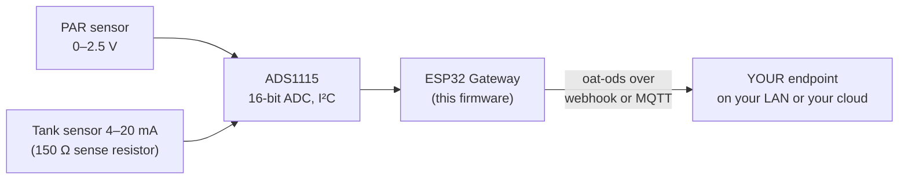

<p align="center">
  
</p>

<p align="center"><em><a href="https://openagriculturetechnology.com/">Open Agriculture Technology</a> is an open collective around one idea:<br>
appropriate technology for growing things — the right tool for the need, the budget, and the environment.</em></p>

<h1 align="center">OAT Analog &amp; 4–20 mA Reader</h1>

<p align="center"><strong>Bring analog and current-loop sensors — the huge install base with no digital bus — into data you own.</strong><br>
One sketch in the <a href="../">OAT Sketch Library</a> — they all share one setup flow and push the same open
<a href="https://openagriculturetechnology.com/standard/">oat-ods</a> format to an endpoint you own.</p>

<p align="center">
  
  
  
  
  <a href="https://openagriculturetechnology.com/build/sketches/analog-reader/"></a>
</p>

---

A world of good sensors speak only analog: a voltage, or a 4–20 mA current loop.
This node reads them cleanly through an **ADS1115** (a 16-bit I²C ADC), applies a
per-channel **linear calibration**, and emits each as oat-ods. The site's
[reading sensor outputs guide](https://openagriculturetechnology.com/technology/reading-sensor-outputs/)
walks all five ways an ESP32 reads industrial sensors, analog and current-loop included.



<p align="center"></p>

```
value = m × volts + b
```

That one linear map covers amplified **0–2.5 V / 0–5 V** outputs *and* **4–20 mA**
(with a sense resistor turning current into a voltage) — you just pick `m` and `b`
to match the sensor's range. The bridge for the huge install base of analog and
current-loop sensors that have no digital bus.

## The channel map

One line per ADS1115 channel on the setup page:

```
<ch> <stream_id> <measure>:<unit>:<m>:<b>
```

Examples:

```
0 canopy-par par:umol/m2/s:800:0      # Apogee SQ-512: 0-2.5V = 0-2000 umol -> m=800, b=0
1 tank       level:%:41.667:-25       # 4-20mA via 150 ohm: 0.6-3.0V -> 0-100%
```

Each channel → one oat-ods message: `stream` = stream_id,
`physical_id` = `ads1115:<ch>`. Measurement names and units come from the shared
[measurand vocabulary](https://openagriculturetechnology.com/standard/reference/) —
using them keeps your data portable across every OAT tool and endpoint.

```json
{
  "stream": "canopy-par",
  "measurement": "par",
  "value": 642,
  "unit": "umol/m2/s",
  "source": { "physical_id": "ads1115:0" }
}
```

This is [**oat-ods**](https://openagriculturetechnology.com/standard/); the full
contract — batch envelope, field tables,
[JSON Schema](https://openagriculturetechnology.com/standard/oat-ods-0.3.schema.json),
sample payloads — lives in the
[developer reference](https://openagriculturetechnology.com/standard/reference/).

### Finding m and b

Two points `(volts, value)` define the line:

```
m = (value2 − value1) / (volts2 − volts1)
b = value1 − m × volts1
```

The setup page's **Live volts** table shows the raw voltage on each channel —
read it at two known sensor states and compute `m`/`b`.

## Wiring

ADS1115 is I²C (3.3 V): **SDA**, **SCL**, **3V3**, **GND** (default addr `0x48`).
Sensor output to **A0–A3**.

- **0–5 V** sensor → put a 2:1 divider in front (the ADS tops out around 4 V even
  at the widest gain) **or** set gain to ±6.144 V.
- **4–20 mA** loop → a precision resistor across the loop (150 Ω → ≈0.6–3.0 V),
  then fold the resistor value into `m`/`b`.

Set the **gain** on the setup page to the smallest full-scale that still covers
your voltage — smaller full-scale = finer resolution.

## Setup

1. Flash (see Build, below), or `pio run -t upload`.
2. Join the node's `OAT-Analog-xxxx` Wi-Fi, open the setup page (admin / `oatsetup`).
3. Set Wi-Fi + delivery (webhook URL **or** MQTT), the I²C pins/gain, and the
   **channel map**. Save & reboot.
4. **Watch it land.** You're welcome to point delivery at OAT's live
   [test endpoint](https://openagriculturetechnology.com/standard/test-endpoint/) —
   a free public sandbox, no account needed. Open the page, pick a box name,
   paste the endpoint URL it gives you into the node's delivery field, and your
   readings appear on that page within seconds — parsed fields alongside the raw
   JSON, with a conformance verdict on every POST. It's the fastest proof the
   whole chain works, before you wire the node into anything real. (It's a
   shared sandbox: boxes are open by name and hold the last 50 readings, so pick
   a distinctive name and send nothing private.)

## Build & flash

```bash
pipx install platformio          # or: pip install --user platformio
cd oat-analog-reader
./build.sh
```

This is a **source release**: it compiles against the pinned deps but hasn't
earned the bench-verified badge the live sketches carry — build it, flash it, and
prove it on your bench before you trust it in the field. Deps (pinned in
`platformio.ini`): `Adafruit ADS1X15`, `PubSubClient`, `ArduinoJson`, and the
local `oat_ods` module.

Rather download than clone? The
[sketch's site page](https://openagriculturetechnology.com/build/sketches/analog-reader/)
offers the `.ino` and the full project zip. When compiled images publish, that
page gains a **flash-from-the-browser Install button** — the
[live sketches](https://openagriculturetechnology.com/build/sketches/) have one
today, no toolchain needed.

## Notes (v1)

- Single-ended reads on A0–A3 (4 channels). Differential pairs are a future rev.
- Linear calibration only; non-linear sensors (e.g. some gas sensors) need a
  curve — out of scope for v1.

## FAQ

**How do I read a 4–20 mA sensor with an ESP32?**
Put a precise sense resistor (commonly 150 Ω) across the current loop so the
4–20 mA becomes roughly 0.6–3.0 V, then read that voltage with a 16-bit ADS1115
ADC over I²C. A linear calibration (value = m × volts + b) maps the voltage back
to the sensor's engineering units.

**Can an ESP32 read 0–5 V analog sensors accurately?**
The ESP32's built-in ADC is noisy and tops out around 3.3 V. An external ADS1115
gives clean 16-bit readings, and for 0–5 V you scale into range with a resistor
divider or use amplified 0–2.5 V outputs. A two-point calibration then converts
volts to the measurement.

## Related

- [`oat-cwsi-node/`](../oat-cwsi-node/) and [`oat-sht30-node/`](../oat-sht30-node/) — the other I²C sketches; same default pins, one wiring habit.
- [`../lib/oat_ods/`](../lib/oat_ods/) — the shared oat-ods encoder + measurand vocabulary.
- [The oat-ods standard](https://openagriculturetechnology.com/standard/) — the wire format.

> **Shared core:** this sketch carries its own copy of the config / Wi-Fi /
> delivery scaffolding; as the shared `oat-node-core` library is adopted, only the
> acquisition layer stays sketch-specific.

---
*Code: Apache-2.0 · Docs: CC BY 4.0 · An [OAT](https://openagriculturetechnology.com/) sketch — an OpenCDC initiative.*
