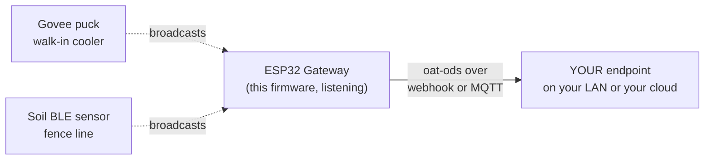
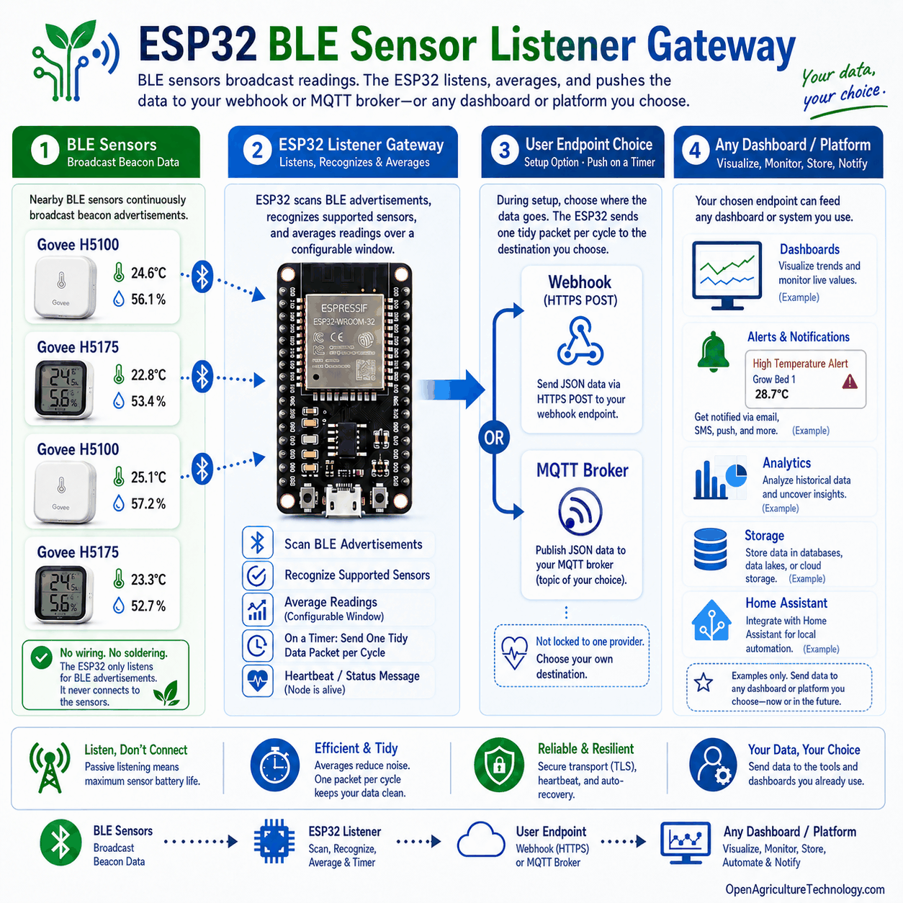

<p align="center">
  
</p>

<p align="center"><em><a href="https://openagriculturetechnology.com/">Open Agriculture Technology</a> is an open collective around one idea:<br>
appropriate technology for growing things — the right tool for the need, the budget, and the environment.</em></p>

<h1 align="center">OAT BLE Sensor Listener</h1>

<p align="center"><strong>Hear cheap Bluetooth thermometers; push the readings to a place you own.</strong><br>
One sketch in the <a href="../">OAT Sketch Library</a> — they all share one setup flow and push the same open
<a href="https://openagriculturetechnology.com/standard/">oat-ods</a> format to an endpoint you own.</p>

<p align="center">
  
  
  
  
  
  <a href="https://openagriculturetechnology.com/build/sketches/ble-sensor-listener/"></a>
</p>

---

A self-configuring ESP32 node that listens for BLE sensor broadcasts — Govee,
Xiaomi, Inkbird, Ruuvi, SwitchBot and ~120 other device types via
[Theengs Decoder](https://decoder.theengs.io/) — harvests **every measurand each
device emits** (temperature, humidity, soil moisture, conductivity, CO₂, PM2.5,
illuminance, pressure, and the rest), folds the chatty readings into steady
values, and pushes them to an endpoint the grower owns, by webhook or MQTT. No
wiring, no pairing, no app: the sensors just broadcast, and this node listens.
What each key means comes from the shared
[measurand vocabulary](https://openagriculturetechnology.com/standard/reference/).



<p align="center"></p>

<p align="center"></p>

**[Flash it from the browser](https://openagriculturetechnology.com/build/sketches/ble-sensor-listener/)** —
the site page installs it over USB via ESP Web Tools (Chrome or Edge), and the
node's own captive portal handles the rest. No IDE needed — or build from source
(below), if that's more your speed.

## Set it up

1. **Flash from the browser** at the
   [sketch's site page](https://openagriculturetechnology.com/build/sketches/ble-sensor-listener/)
   (Chrome or Edge, ESP Web Tools; one button, auto-detects your chip) — or
   build it yourself (see Build, below).
2. Join the node's own Wi-Fi (`OAT-…`) and its captive portal walks you through
   Wi-Fi, delivery (webhook URL **or** MQTT), and naming.
3. Power up your BLE sensors anywhere in earshot — no pairing, nothing to
   configure on the sensor side; the listener reports what it hears.
4. **Watch it land.** Point the node at the live
   [Open Agriculture Technology Test Endpoint](https://iot-test.openagriculturetechnology.com/) —
   enter `https://iot-test.openagriculturetechnology.com/ingest` as the endpoint
   URL. (The push engine is HTTPS-preferred; if TLS ever won't fit the chip's
   memory it falls back to signed HTTP on its own — the oat1 signature keeps
   even that safe. You just enter the URL.) Then open the console
   and pick your farm — the gateway name you set at setup: **your gateway and
   its sensors are there, live** — readings, charts, heartbeat. No account, no
   registration; showing up in the data is the registration. It's a
   proof-of-life bench (readings are kept about an hour): prove your chain
   works, then point the node at an endpoint you keep. Want a per-message
   schema verdict instead? The
   [conformance sandbox](https://openagriculturetechnology.com/standard/test-endpoint/)
   checks every POST against the standard.

## What a reading looks like

```json
{
  "stream": "gv5075-cooler",
  "measurement": "humidity",
  "value": 61.2,
  "unit": "%RH",
  "agg": { "window_s": 300, "samples": 42, "method": "mean" },
  "source": { "physical_id": "ble:a4c138aa12f0", "brand": "Govee",
              "model": "H5075", "battery_pct": 87, "rssi": -71 }
}
```

One record per measurand — a flower-care sensor emits temperature, soil
moisture, conductivity, illuminance, *and* battery, not just temperature. This
is [**oat-ods**](https://openagriculturetechnology.com/standard/); the full
contract — batch envelope, field tables,
[JSON Schema](https://openagriculturetechnology.com/standard/oat-ods-0.3.schema.json),
sample payloads — lives in the
[developer reference](https://openagriculturetechnology.com/standard/reference/).

## Files

| File | What it is |
|---|---|
| `oat_ble_listener.ino` | The firmware source (Arduino / ESP32). |
| `platformio.ini` | Multi-chip build matrix (ESP32, S3, C3, C6). Pinned libs. |
| `merge_bin.py` | Post-build hook → one **merged factory image** per chip at `out/firmware-<mcu>.bin`, flashable at offset 0. |
| `make_manifest.py` | Assembles `manifest.json` from whatever bins exist (data-driven). |
| `build.sh` | Builds every chip, copies bins + manifest into the site assets. |

## Build

**You don't need this section to use the node** — it flashes from the browser on
[its site page](https://openagriculturetechnology.com/build/sketches/ble-sensor-listener/).
Building it yourself — PlatformIO core only, no Arduino IDE:

```bash
pipx install platformio        # or: pip install --user platformio
./build.sh
```

`build.sh` produces one merged, flash-at-offset-0 image per chip in `out/`, plus
the `manifest.json` the OAT site's flash-from-browser page serves.

**First-build knob:** if `pio run` can't resolve the platform, bump the
pioarduino release pin in `platformio.ini` (it tracks Arduino-ESP32 3.x, which
NimBLE 2.x and the native-USB chips need). That pin is the one thing to verify.

## The chip matrix — support broad, recommend narrow

Built for every WiFi+BLE ESP32; the site's buy-list recommends the **native-USB**
ones (no driver — the #1 newbie wall):

| Chip | USB | In the build | Recommended to buy |
|---|---|---|---|
| ESP32 (classic) | external bridge (CP2102/CH340) | yes | no (driver friction) |
| ESP32-S3 | native | yes | **yes** |
| ESP32-C3 | native | yes | **yes** (cheapest) |
| ESP32-C6 | native | yes | yes (WiFi 6) |
| ESP32-S2 / H2 / P4 | — | **no** | — (no BLE / no WiFi / no radio) |

One ESP Web Tools button serves them all: it reads the chip and auto-picks the
matching build. Adding a chip = add an env in `platformio.ini`; `make_manifest.py`
picks it up.

## What it sends — `oat-ods/0.3`

A signed JSON **batch**: a shared `source` (assignable gateway id, tier, fw) plus a
`messages` array of per-measurement records. Each record carries its logical `stream`
(the sensor), the canonical `measurement` + SenML `unit`, the folded `value`, an `agg`
block (window, samples, method), and swappable `source` provenance (physical MAC,
brand, model, battery, rssi). One record per measurand — a flower-care sensor emits
temperature + soil_moisture + soil_conductivity + illuminance + battery, not just temp.

Units are canonical on the wire (°C, %RH, ppm, lx …); the endpoint derives dewpoint
and VPD from temperature + humidity. Big fan-ins are **chunked** into bounded,
independently-signed POSTs (chip-aware) so the body + JSON DOM + TLS block always fit
in heap. MQTT sends one small retained message per measurement. A decoder key the
dictionary hasn't mapped is forwarded raw (no unit) and listed on `/status` so it can
be promoted. The schema id travels in the packet so the endpoint can version it.

## Gotchas (also in the sketch header)

1. ArduinoJson flag alignment with TheengsDecoder (you may need to drop
   `ARDUINOJSON_USE_LONG_LONG=1`). https://decoder.theengs.io/use/include.html
2. PubSubClient's 256-byte default buffer is too small — set at build + runtime.
3. NimBLE **2.x** API (differs from 1.x). Paired with Arduino-ESP32 3.x.
4. TLS uses `setInsecure()` for newbie-friendly first contact; pin a cert for
   production.

## FAQ

**Do I have to pair the sensors?**
No. BLE sensors like Govee and Xiaomi broadcast their readings continuously to
anyone listening — that's how their own phone apps work. This node simply
listens; nothing is configured, paired, or changed on the sensor.

**Which sensors does it hear?**
Roughly 120 device types via the open Theengs Decoder project: Govee, Xiaomi,
Inkbird, Ruuvi, SwitchBot, ThermoPro and more — thermometers, hygrometers, soil
sensors, scales, air-quality monitors. If a device's decoder key isn't in the
vocabulary yet, the reading is forwarded raw and listed on the node's status
page so it can be promoted.

**Can it watch only my sensors?**
Yes — an optional allow-list of MAC addresses. Empty, it reports every device
emitting a known physical measurement in earshot; filled, only yours.

## License

TheengsDecoder is GPL-family, so a **distributed** binary inherits that
obligation — which is exactly why this source ships openly. Unlike its Apache-2.0
siblings in this library, treat this sketch as GPL-governed when you distribute
builds of it. Keep it open; it's the right posture for OAT anyway.

---
*Docs: CC BY 4.0 · An [OAT](https://openagriculturetechnology.com/) sketch — an OpenCDC initiative.*
