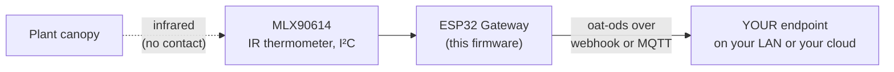

<p align="center">
  
</p>

<p align="center"><em><a href="https://openagriculturetechnology.com/">Open Agriculture Technology</a> is an open collective around one idea:<br>
appropriate technology for growing things — the right tool for the need, the budget, and the environment.</em></p>

<h1 align="center">OAT Canopy Temperature (CWSI) Node</h1>

<p align="center"><strong>Read the plant's own temperature — the earliest signal of water stress — with a no-contact infrared eye.</strong><br>
One sketch in the <a href="../">OAT Sketch Library</a> — they all share one setup flow and push the same open
<a href="https://openagriculturetechnology.com/standard/">oat-ods</a> format to an endpoint you own.</p>

<p align="center">
  
  
  
  
  <a href="https://openagriculturetechnology.com/build/sketches/cwsi-node/"></a>
</p>

---

A plant tells you it's thirsty before it wilts: its canopy runs warmer than the
air as stomata close. This node reads canopy temperature with a no-contact
infrared thermometer pointed at the canopy — the agronomy behind the signal is
on the site's [canopy stress page](https://openagriculturetechnology.com/grow/cwsi/) —
and reports three measurements under one stream:



<p align="center"></p>

- `canopy_temperature` — the leaf/canopy surface temp (IR object temp)
- `air_temperature` — the sensor's ambient temp (an air-temp proxy)
- `canopy_air_delta` — canopy minus air, the core water-stress signal

**CWSI is a derived index, not a raw reading.** It needs the canopy–air delta
*and* vapor-pressure deficit (from air temp + RH). This node provides the canopy
ingredient; the CWSI index is computed in the Use layer where VPD is known. The
quick read: a **cool** canopy (negative delta) = transpiring / well-watered; a
**warm** canopy (positive delta) = stomata closing / water stress.

## Wiring

MLX90614 is I²C (3.3 V): SDA, SCL, 3V3, GND. Default pins SDA=21 / SCL=22
(configurable on the setup page — C3/C6 boards differ). Aim it at the canopy, not
the soil or pot, and avoid sun glinting into the sensor.

## Setup

1. Flash (see Build, below), or `pio run -t upload`.
2. Join the node's `OAT-CWSI-xxxx` Wi-Fi, open the setup page (admin / `oatsetup`).
3. Set Wi-Fi + delivery (webhook URL **or** MQTT), the **stream id** (the canopy
   spot, e.g. `gh2-canopy`), and the interval. Save & reboot.
4. **Watch it land.** You're welcome to point delivery at OAT's live
   [test endpoint](https://openagriculturetechnology.com/standard/test-endpoint/) —
   a free public sandbox, no account needed. Open the page, pick a box name,
   paste the endpoint URL it gives you into the node's delivery field, and your
   readings appear on that page within seconds — parsed fields alongside the raw
   JSON, with a conformance verdict on every POST. It's the fastest proof the
   whole chain works, before you wire the node into anything real. (It's a
   shared sandbox: boxes are open by name and hold the last 50 readings, so pick
   a distinctive name and send nothing private.) And to see a full,
   live endpoint at work — our own gateways pushing right now — the
   [Open Agriculture Technology Test Endpoint](https://iot-test.openagriculturetechnology.com/)
   is open, no sign-in.

## What a reading looks like

```json
{
  "stream": "gh2-canopy",
  "measurement": "canopy_air_delta",
  "value": -2.4,
  "unit": "Cel",
  "source": { "physical_id": "mlx90614" }
}
```

A cool canopy (negative delta) is transpiring and well-watered; a warm canopy
(positive delta) means stomata are closing. This is
[**oat-ods**](https://openagriculturetechnology.com/standard/); the full
contract — batch envelope, field tables,
[JSON Schema](https://openagriculturetechnology.com/standard/oat-ods-0.3.schema.json),
sample payloads — lives in the
[developer reference](https://openagriculturetechnology.com/standard/reference/).

## Build & flash

```bash
pipx install platformio          # or: pip install --user platformio
cd oat-cwsi-node
./build.sh
```

This is a **source release**: it compiles against the pinned deps but hasn't
earned the bench-verified badge the live sketches carry — build it, flash it, and
prove it on your bench before you trust it in the field. Deps (pinned in
`platformio.ini`): `Adafruit MLX90614 Library`, `PubSubClient`, `ArduinoJson`,
and the local `oat_ods` module.

Rather download than clone? The
[sketch's site page](https://openagriculturetechnology.com/build/sketches/cwsi-node/)
offers the `.ino` and the full project zip. When compiled images publish, that
page gains a **flash-from-the-browser Install button** — the
[live sketches](https://openagriculturetechnology.com/build/sketches/) have one
today, no toolchain needed.

## FAQ

**How do you measure crop water stress with a sensor?**
Point a non-contact infrared thermometer at the canopy and compare leaf
temperature to air temperature. A canopy warmer than the air indicates closing
stomata and water stress; a cooler canopy indicates active transpiration.
Combined with vapor-pressure deficit, the canopy–air difference yields the Crop
Water Stress Index (CWSI).

**What sensor reads leaf or canopy temperature?**
A non-contact infrared thermometer such as the MLX90614 reads surface temperature
from a short distance without touching the leaf. Aimed at the canopy it reports
the canopy surface temperature, and its onboard ambient sensor gives a nearby
air-temperature reference.

## Related

- [`oat-sht30-node/`](../oat-sht30-node/) — pairs naturally: its temp + RH gives the VPD the CWSI calculation needs.
- [`../lib/oat_ods/`](../lib/oat_ods/) — the shared oat-ods encoder + measurand vocabulary.
- [Canopy stress on the OAT Library](https://openagriculturetechnology.com/grow/cwsi/) — the agronomy behind the signal.

> **Shared core:** this sketch carries its own copy of the config / Wi-Fi /
> delivery scaffolding; as the shared `oat-node-core` library is adopted, only the
> MLX read + emit stays sketch-specific.

---
*Code: Apache-2.0 · Docs: CC BY 4.0 · An [OAT](https://openagriculturetechnology.com/) sketch — an OpenCDC initiative.*
