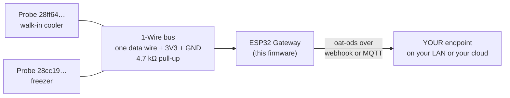

<p align="center">
  
</p>

<p align="center"><em><a href="https://openagriculturetechnology.com/">Open Agriculture Technology</a> is an open collective around one idea:<br>
appropriate technology for growing things — the right tool for the need, the budget, and the environment.</em></p>

<h1 align="center">OAT DS18B20 Temperature Node</h1>

<p align="center"><strong>One wire, many probes, every reading landing somewhere you own.</strong><br>
One sketch in the <a href="../">OAT Sketch Library</a> — they all share one setup flow and push the same open
<a href="https://openagriculturetechnology.com/standard/">oat-ods</a> format to an endpoint you own.</p>

<p align="center">
  
  
  
  
  
  <a href="https://openagriculturetechnology.com/build/sketches/ds18b20-node/"></a>
</p>

---

A self-configuring ESP32 node that reads **one or many
[DS18B20 temperature probes](https://openagriculturetechnology.com/hardware/sensors/temperature-humidity/ds18b20/)**
on a single 1-Wire data line and pushes the readings as **oat-ods** to an
endpoint the grower owns, by webhook or MQTT. Every probe carries its own
factory-lasered address, so one board can watch a whole cold room, a tank, or a
row of coolers — each with its own stream.



<p align="center"></p>

Every OAT sketch shares one core: the same setup page and captive portal, the
same Wi-Fi flow, the same push engine (HTTPS-preferred, HMAC-signed, batched),
the same 60-second health heartbeat, and the same two-way USB console. **Set up
one OAT node and you have set up all of them** — only the sensor read differs.

**[Flash it from the browser](https://openagriculturetechnology.com/build/sketches/ds18b20-node/)** —
the site page installs it over USB via ESP Web Tools (Chrome or Edge), and the
node's own setup page handles the rest. No IDE needed — or build from source
(below), if that's more your speed.

## Wiring

| DS18B20 | ESP32 | wire colour on a sealed probe |
|---|---|---|
| VDD | **3V3** | red |
| GND | GND | black |
| DQ (data) | **the data pin** (default below) | yellow, sometimes white or blue |

Plus **one 4.7 kΩ resistor between DQ and 3V3** — see below. Every probe on the run
shares all three wires.

### The default data pin, per chip

| Board | Default | Why not the same number everywhere |
|---|---|---|
| Classic ESP32 | **GPIO 4** | free; not flash, not strapping, not input-only |
| ESP32-S3 | **GPIO 4** | free |
| ESP32-C3 | **GPIO 4** | free |
| ESP32-C6 | **GPIO 6** | GPIO 4 is a **strapping pin** on the C6 |

A 1-Wire bus idles HIGH through its pull-up, which is exactly the nudge that flips
a strapping pin into the wrong boot mode — so the C6 gets a different default
rather than a shared one that would sometimes break a boot. `pinOkForOneWire()`
refuses flash, strapping, USB-JTAG, UART0 and input-only pins **per chip, with the
reason**, because a bad pin is persisted in NVS and re-applied at every boot: it is
not a mistake you get to notice and correct.

Pin lists are from Espressif's per-chip GPIO documentation, not folklore.

## The resistor is not optional

1-Wire is an **open-drain** bus: devices only ever pull the line DOWN, and a
pull-up resistor is the only thing that pulls it back UP. With no resistor there is
no bus at all, just a floating pin reading noise — which looks exactly like a
broken sensor.

- Fit **one 4.7 kΩ** resistor between the data line and 3V3, **once for the whole
  bus**, not once per probe. Anywhere on the run works; near the board is easiest.
- Many sealed probe modules and breakout boards have it fitted already. A bare
  TO-92 chip or a plain 3-wire cable does not.
- Long run, or several probes, and reads go intermittent? **2.2 kΩ** is the next
  thing to try: a stiffer pull-up recovers the edges that cable capacitance rounds
  off. Beyond that: linear topology rather than a star, and eventually an active
  pull-up (Maxim application note 148 covers real 1-Wire networks).

## How many probes on one wire

The **protocol** sets no limit. Every DS18B20 carries a unique 64-bit address
lasered in at the factory (family code `28h` + 48-bit serial + CRC), and the node
enumerates whatever is present with the ROM SEARCH command (`F0h`, the algorithm
from Maxim application note 187). Addressing is not the constraint.

The **electrical** limit is real: every device and every metre of cable adds
capacitance, which rounds off the edges of a 60 µs bit until the bus stops being
readable. On a short run with the standard 4.7 kΩ pull-up, eight to ten probes is
comfortable. This firmware caps its list at `MAX_DS` (10) for that reason — an
honest bound of ours, not a protocol one, and it says so on the console when the
list fills.

## Set it up

1. **Flash from the browser** at the
   [sketch's site page](https://openagriculturetechnology.com/build/sketches/ds18b20-node/)
   (Chrome or Edge, ESP Web Tools) — no IDE, no command line. Or build it
   yourself (see Build, below).
2. Join the node's own Wi-Fi (`OAT-…`) and its setup page walks you through
   Wi-Fi, delivery (webhook URL **or** MQTT), the data pin, and naming.
3. Wire the probes (above) and hit **re-scan** — every probe on the wire appears
   by its own address.
4. **Watch it land.** Point the node at the live
   [Open Agriculture Technology Test Endpoint](https://iot-test.openagriculturetechnology.com/) —
   enter `https://iot-test.openagriculturetechnology.com/ingest` as the endpoint
   URL. (The push engine is HTTPS-preferred; if TLS ever won't fit the chip's
   memory it falls back to signed HTTP on its own — the oat1 signature keeps
   even that safe. You just enter the URL.) Then open the console
   and pick your farm — the gateway name you set at setup: **your gateway and
   its sensors are there, live** — readings, charts, heartbeat. No account, no
   registration; showing up in the data is the registration. It's a
   proof-of-life bench (readings are kept about an hour): prove your chain
   works, then point the node at an endpoint you keep. Want a per-message
   schema verdict instead? The
   [conformance sandbox](https://openagriculturetechnology.com/standard/test-endpoint/)
   checks every POST against the standard.

## What it reports

| measurement | unit | fold over the push window |
|---|---|---|
| `temperature` | `Cel` | mean |

```json
{
  "stream": "walk-in-cooler",
  "measurement": "temperature",
  "value": 3.6,
  "unit": "Cel",
  "agg": { "window_s": 300, "samples": 10, "method": "mean" },
  "source": { "physical_id": "ds18b20:28ff641f8c1a3b02" }
}
```

This is [**oat-ods**](https://openagriculturetechnology.com/standard/); the full
contract — batch envelope, field tables,
[JSON Schema](https://openagriculturetechnology.com/standard/oat-ods-0.3.schema.json),
sample payloads — lives in the
[developer reference](https://openagriculturetechnology.com/standard/reference/).

One stream per probe. `source.physical_id` carries the probe's own 64-bit address
(`ds18b20:28ff641f8c1a3b02`), so a reading is traceable to a **chip**, not to a
position in a list: swap a failed probe and the history of that spot carries on
with the change of hardware visible in the record.

Probes are listed in address order, so the numbering on the setup page is stable
across reboots even when one is added.

## The parts that matter

- **The bus is bit-banged here, not a library.** Reset/presence, read and write
  slots, the CRC and the ROM search are all in this file, about two hundred
  readable lines, with the datasheet's timings quoted where they are used. One
  less pinned dependency between a grower and a working node, and the CRC is
  genuinely checked rather than assumed.
- **Only the edges hold interrupts off.** A bit slot is protected by a critical
  section because a task switch mid-slot is a corrupted bit. The 480 µs reset LOW
  is not: it only has to be *at least* 480 µs, so blocking WiFi's interrupts
  through it would cost packets for nothing.
- **CRC-checked, and a failed CRC is discarded, not reported.** A long or damp wire
  produces plausible-looking garbage; a wrong number is worse than a missing one.
  "No answer" and "bad CRC" are counted **separately**, because a pulled wire and a
  marginal bus are different problems with different fixes.
- **85.00 °C is discarded.** That is the datasheet's power-on value of the
  temperature register: seeing it means the probe reset or the conversion never
  ran, so the register was never written. Publishing it would be publishing a
  default as an observation. (If you genuinely need to measure 85 °C, this is the
  wrong node — better to say so than to quietly make it up.)
- **Parasite power is detected and called out.** A DS18B20 can run on two wires,
  stealing power from the data line, but conversions then need a strong pull-up
  this node does not drive. `READ POWER SUPPLY` (`B4h`) reports it and the status
  page says "wire VDD to 3V3" rather than pretending the readings are fine.
- **Reading happens in two halves.** A 12-bit conversion takes up to 750 ms.
  Blocking the node for that every cycle would stall the setup page and the push
  engine, so the sample timer **issues** the conversion for every probe at once
  (`SKIP ROM` + `CONVERT T`) and the loop **collects** the results once the window
  has passed. A person pressing "read now" gets the blocking version, because a
  person is waiting.
- **A re-scan keeps each probe's history.** Counters are carried across by address,
  because resetting "reads failed" to zero in the middle of the fault the re-scan
  exists to recover from would hide the one thing worth seeing.
- **A probe that stops answering is dropped from the live view**, rather than left
  showing its last reading in live-value type. The failure detail replaces it.
- **`agg.window_s` is the window actually covered**, not the configured interval.
  Sampling continues while the network is down, so the first push after an outage
  can carry hours of readings, and it says so.
- **Remote diagnosis.** When a probe dies, the 60 s heartbeat keeps arriving while
  the readings stop. That contrast — alive but quiet — is what the endpoint
  watches, and it is why the heartbeat is sent before the sensor push.

## Resolution

9 to 12 bits, set on the setup page and written to every probe on the wire.

| bits | step | conversion |
|---|---|---|
| 9 | 0.5 °C | 93.75 ms |
| 10 | 0.25 °C | 187.5 ms |
| 11 | 0.125 °C | 375 ms |
| 12 | 0.0625 °C | 750 ms |

Default is 12. The unused low bits at lower resolutions are masked rather than
reported as decimal places they do not carry.

Specs above are from the DS18B20 datasheet (Analog Devices / Maxim): ±0.5 °C from
−10 °C to +85 °C, ±2 °C over the full −55 °C to +125 °C range.

## Files

| File | What it is |
|---|---|
| `oat_ds18b20_node.ino` | The firmware source (Arduino / ESP32). |
| `platformio.ini` | Build config. Four envs: classic ESP32, S3, C3, C6. Pinned libs. |
| `merge_bin.py` | Post-build hook → one **merged factory image** per chip at `out/firmware-<mcu>.bin`, flashable at offset 0. |
| `make_manifest.py` | Assembles `manifest.json` + `manifest-<mcu>.json` from whatever bins exist. |
| `build.sh` | Builds, then copies bins + manifests + source downloads into the site assets. |
| `docker-build.sh` | The same compile with no host toolchain (Docker + PlatformIO). |

## Build

**You don't need this section to use the node** — it flashes from the browser on
[its site page](https://openagriculturetechnology.com/build/sketches/ds18b20-node/).
Building it yourself:

```bash
pipx install platformio        # or: pip install --user platformio
./build.sh
```

No host toolchain?

```bash
./docker-build.sh              # compile all four chips in Docker
SKIP_BUILD=1 ./build.sh        # then the asset steps
```

`build.sh` produces one merged, flash-at-offset-0 image per chip in `out/`, plus
the manifest and download bundle the OAT site's flash-from-browser page serves.

## FAQ

**How many DS18B20 probes fit on one wire?**
The protocol sets no limit — every probe has a unique 64-bit factory address and
the node enumerates whatever answers. The electrical limit is real: cable
capacitance rounds off the 60 µs bits, so with the standard 4.7 kΩ pull-up,
eight to ten probes on a short run is comfortable. This firmware caps its list
at ten and says so on the console when the list fills.

**Why does my DS18B20 read exactly 85.00 °C?**
That's the sensor's power-on default, not a measurement — it means the probe
reset or the conversion never ran. This node discards it rather than publishing
a default as an observation.

**Do I really need the 4.7 kΩ resistor?**
Yes. 1-Wire is an open-drain bus: devices only pull the line down, and the
pull-up resistor is the only thing that pulls it back up. Without it there's no
bus, just a floating pin reading noise — which looks exactly like a broken
sensor. One resistor for the whole bus; many sealed probe modules have it
fitted already.

## Related

- [`oat-sht30-node/`](../oat-sht30-node/) — the wired sibling: air temperature *and* humidity, on I²C.
- [`oat-ble-listener/`](../oat-ble-listener/) — the reference node this core comes from.
- [`../lib/oat_ods/`](../lib/oat_ods/) — the shared oat-ods encoder + measurand vocabulary.
- [`../lib/oat_sign/`](../lib/oat_sign/) — the shared HMAC push signer.
- [The oat-ods standard](https://openagriculturetechnology.com/standard/reference/) — the wire format.

---
*Code: Apache-2.0 · Docs: CC BY 4.0 · An [OAT](https://openagriculturetechnology.com/) sketch — an OpenCDC initiative.*
