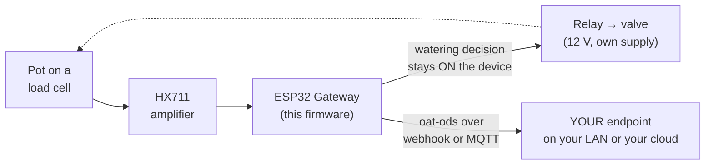

<p align="center">
  
</p>

<p align="center"><em><a href="https://openagriculturetechnology.com/">Open Agriculture Technology</a> is an open collective around one idea:<br>
appropriate technology for growing things — the right tool for the need, the budget, and the environment.</em></p>

<h1 align="center">OAT Load-Cell Watering Node</h1>

<p align="center"><strong>Weigh a pot to see exactly how much water a plant used — and water it locally, with no cloud in the loop.</strong><br>
One sketch in the <a href="../">OAT Sketch Library</a> — they all share one setup flow and push the same open
<a href="https://openagriculturetechnology.com/standard/">oat-ods</a> format to an endpoint you own.</p>

<p align="center">
  
  
  
  
  <a href="https://openagriculturetechnology.com/build/sketches/loadcell-water/"></a>
</p>

---

The most honest irrigation signal is weight: a pot gets lighter as the plant
drinks. This node weighs a pot or basket on a load cell (via an **HX711**), emits
the readings as oat-ods, and runs a **local weigh-and-water loop**. One cheap
build gives you two signals and an irrigation trigger:



<p align="center"></p>

- `weight` (g) — what's on the cell
- `transpiration` (g/h) — the drydown slope between samples = the plant's water use
- a **local watering trigger** — water when the weight drops below a target, stop
  at a refill target or a hard pump-time cap

## No cloud in the actuation path

The watering **decision lives entirely on the device.** oat-ods carries readings
*out* for monitoring; nothing ever commands the valve from the cloud. Failure is
designed for:

- the relay is **OFF on boot** (valve closed),
- every watering is **capped at a max pump time** (a stuck reading can't flood),
- a **cooldown** prevents rapid re-watering,
- watering only acts on a **valid, calibrated** reading.

A lost network changes nothing about whether the plant gets watered — only the
monitoring stops.

## Calibrate (on the live-status page)

1. Empty the cell → **Tare (zero)**.
2. Put a known weight on → **Set scale** with its grams. Done — readings are now in grams.

## Wiring

HX711 DOUT + SCK to two GPIOs (default 16 / 17), plus VCC/GND; the load cell's
four wires to the HX711. The valve/pump on the relay GPIO (default 25) — usually a
12 V solenoid switched through the relay, on its **own supply**, separate from the
ESP32. Set "Active high" to match your relay module.

## Setup

1. Flash (see Build, below), or `pio run -t upload`.
2. Join the node's `OAT-Scale-xxxx` Wi-Fi, open the setup page (admin / `oatsetup`).
3. Set Wi-Fi + delivery (webhook URL **or** MQTT) and the **stream id** (the pot,
   e.g. `bench-pot-3`). Calibrate on the status page. To use the loop: tick
   **Enable local watering**, set the relay pin, water-below / refill-to weights,
   the pump-max cap, and the cooldown.
4. **Watch it land.** Point the node at the live
   [Open Agriculture Technology Test Endpoint](https://iot-test.openagriculturetechnology.com/) —
   enter `https://iot-test.openagriculturetechnology.com/ingest` as the endpoint
   URL. (The push engine is HTTPS-preferred; if TLS ever won't fit the chip's
   memory it falls back to signed HTTP on its own — the oat1 signature keeps
   even that safe. You just enter the URL.) Then open the console
   and pick your farm — the gateway name you set at setup: **your gateway and
   its sensors are there, live** — readings, charts, heartbeat. No account, no
   registration; showing up in the data is the registration. It's a
   proof-of-life bench (readings are kept about an hour): prove your chain
   works, then point the node at an endpoint you keep. Want a per-message
   schema verdict instead? The
   [conformance sandbox](https://openagriculturetechnology.com/standard/test-endpoint/)
   checks every POST against the standard.

## What a reading looks like

```json
{
  "stream": "bench-pot-3",
  "measurement": "weight",
  "value": 1840,
  "unit": "g",
  "source": { "physical_id": "hx711:bench3" }
}
```

The drydown slope between readings is the plant's water use, reported as
`transpiration` in g/h. This is
[**oat-ods**](https://openagriculturetechnology.com/standard/); the full
contract — batch envelope, field tables,
[JSON Schema](https://openagriculturetechnology.com/standard/oat-ods-0.3.schema.json),
sample payloads — lives in the
[developer reference](https://openagriculturetechnology.com/standard/reference/).

## Build & flash

```bash
pipx install platformio          # or: pip install --user platformio
cd oat-loadcell-water
./build.sh
```

This is a **source release**: it compiles against the pinned deps but hasn't
earned the bench-verified badge the live sketches carry — build it, flash it, and
prove it on your bench before you trust it with a valve. Deps (pinned in
`platformio.ini`): `bogde/HX711`, `PubSubClient`, `ArduinoJson`, and the local
`oat_ods` module.

Rather download than clone? The
[sketch's site page](https://openagriculturetechnology.com/build/sketches/loadcell-water/)
offers the `.ino` and the full project zip. When compiled images publish, that
page gains a **flash-from-the-browser Install button** — the
[live sketches](https://openagriculturetechnology.com/build/sketches/) have one
today, no toolchain needed.

## FAQ

**Can you automate watering without a cloud service?**
Yes. A microcontroller can weigh a pot, decide when it is light enough to water,
and switch a valve entirely on the device, with no internet involved. Safety
comes from local rules: the relay starts closed, each watering has a hard time
cap, a cooldown prevents rapid cycling, and it acts only on a valid calibrated
reading. Readings are still sent out for monitoring, but the decision never
depends on the network.

**How do you measure how much water a plant uses?**
Weigh the pot over time. As the plant transpires and the medium dries, the pot
gets lighter; the rate of weight loss (grams per hour) is a direct measure of
water use. A load cell with an HX711 amplifier on a microcontroller gives the
weight, and the slope between readings gives the drydown rate.

## Related

- [`../lib/oat_ods/`](../lib/oat_ods/) — the shared oat-ods encoder + measurand vocabulary.
- [The oat-ods standard](https://openagriculturetechnology.com/standard/) — the wire format.

> **Shared core:** this sketch carries its own copy of the config / Wi-Fi /
> delivery scaffolding; as the shared `oat-node-core` library is adopted, only the
> load-cell read + the local loop stays sketch-specific. This is also the first
> sketch that **actuates** — the fail-safe rules (off-on-boot, time cap, cooldown)
> are load-bearing in any future revision.

---
*Code: Apache-2.0 · Docs: CC BY 4.0 · An [OAT](https://openagriculturetechnology.com/) sketch — an OpenCDC initiative.*
