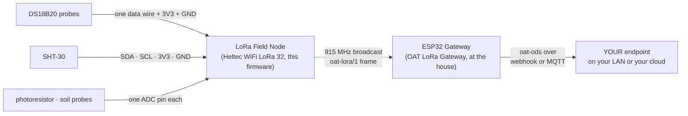

<p align="center">
  
</p>

<p align="center"><em><a href="https://openagriculturetechnology.com/">Open Agriculture Technology</a> is an open collective around one idea:<br>
appropriate technology for growing things — the right tool for the need, the budget, and the environment.</em></p>

<h1 align="center">OAT LoRa Field Node</h1>

<p align="center"><strong>Every sensor in the greenhouse on one board, broadcasting home over 915 MHz. No Wi-Fi anywhere near it.</strong><br>
One sketch in the <a href="../">OAT Sketch Library</a> — they all share one setup flow and push the same open
<a href="https://openagriculturetechnology.com/standard/">oat-ods</a> format to an endpoint you own.</p>

<p align="center">
  
  
  
  
  
  
  <a href="https://openagriculturetechnology.com/build/sketches/lora-field-node/"></a>
</p>

---

**Flash this sketch onto an ESP32 with a LoRa radio — a Heltec WiFi LoRa 32 —
and the board becomes a field node.** It reads the probes wired to it —
[DS18B20](https://openagriculturetechnology.com/build/sketches/ds18b20-node/)
temperature probes (up to sixteen on one wire), an
[SHT-30](https://openagriculturetechnology.com/build/sketches/sht30-node/) for
air temperature and humidity (one or two), a photoresistor, up to eight
capacitive soil probes, its own battery, and anything cabled to its pod port —
and every few minutes broadcasts one small frame on a private 915 MHz channel.
No Wi-Fi, no internet, no account, no pairing, no reply expected. The
[OAT LoRa Gateway](../oat-lora-gateway/) at the house hears it and pushes
oat-ods on this node's behalf, the way the BLE Listener does for a Bluetooth
thermometer: this node is a Govee with a longer antenna. The gateway is the
node that hosts its own setup page; this one, having no Wi-Fi, is set up over
its USB console. A live [Test Endpoint](https://iot-test.openagriculturetechnology.com/)
is ready to catch your first reading through the gateway ([Set it up](#set-it-up), step 5).



**[Flash it from the browser](https://openagriculturetechnology.com/build/sketches/lora-field-node/)** —
the site page installs it over USB via ESP Web Tools (Chrome or Edge). No IDE
needed — or build from source (below), if that's more your speed.

## Standalone by design

Every other sketch in this library links the shared node core: the setup page,
Wi-Fi, the push engine. This one cannot, because it has no Wi-Fi on purpose — a
field node with Wi-Fi is a Wi-Fi node with a worse battery. So it owns its own
small console and settings store, and the gateway does the pushing. Everything
that reaches your endpoint is ordinary oat-ods, tagged with the gateway's tier,
with each field sensor as its own stream.

## Set it up

1. **Flash from the browser** at the
   [sketch's site page](https://openagriculturetechnology.com/build/sketches/lora-field-node/)
   (Chrome or Edge, ESP Web Tools) — or build it yourself (see Build, below).
   Pick the button for **your exact board**: a V4 flashed with the V3 image
   boots, says "radio ok", and transmits into nothing, because its radio front
   end stays unpowered. Attach the antenna to the **LoRa** u.FL before power.
2. Open the USB serial console at 115200 (the browser flasher's own console, or
   any serial terminal) and type `help`. `status` shows every probe found with
   its serial and reading; `show` prints the settings.
3. Wire what you have (table below). DS18B20 and SHT-30 are found by themselves;
   `scan` finds a probe wired since boot. **Analog pins are declared, never
   discovered** — `set lightpin 4` or `set soilpins 3,4` — because a floating ADC
   pin reads like a wet probe.
   **Calibrate each soil probe at the bench**, before the node goes out: hold it
   in dry air and `set cal 3 dry`, stand it in a glass of water to the line and
   `set cal 3 wet`, using the probe's own GPIO. Every probe keeps its own pair
   (`show` prints the table; `set cal 3 2876 1232` types one back in). A probe
   with no calibration sends raw millivolts only, no percentage. The same code,
   explained at length, is the [Soil-Moisture Node](../oat-soil-moisture-node/).
4. Leave the radio plan at its defaults unless you changed them on the gateway:
   915.0 MHz · 125 kHz · SF7 · sync word `12`. `set cadence 120` changes the
   transmit interval (60 s floor). `tx` sends a frame now.
5. **Watch it land.** With the [gateway](../oat-lora-gateway/) pointed at the live
   [Open Agriculture Technology Test Endpoint](https://iot-test.openagriculturetechnology.com/)
   (endpoint URL `https://iot-test.openagriculturetechnology.com/ingest`), open
   the console and pick your farm — the gateway's name: **this node's probes are
   there, live**, each under its own factory serial, with the node's signal and
   battery beside them. No account, no registration; showing up in the data is
   the registration.

## Wiring

Every pin below is a setting (`set dspin 33`, `set sda 17`, …); these are the
defaults per board. The SHT-30 shares the OLED's I²C pins by default; moved to
other pins it gets its own bus, so a sensor change can never take the screen
down.

| Board | DS18B20 data | SHT-30 SDA / SCL | light (suggested) | soil (suggested) | battery | pod port RX / TX |
|---|---|---|---|---|---|---|
| Heltec WiFi LoRa 32 **V4** | GPIO 33 | 17 / 18 | 4 | 6 | on-board divider, GPIO 1 | 47 / 48 |
| Heltec WiFi LoRa 32 **V3** | GPIO 7 | 17 / 18 | 2 | 3, 4, 5, 6 | on-board divider, GPIO 1 | 40 / 41 |
| Heltec WiFi LoRa 32 **V2 / V2.1** | GPIO 13 | 4 / 15 | 36 | 38, 39, 32, 33 | on-board divider, GPIO 37 | 17 / 23 |

- **DS18B20:** data to the pin, a 4.7 k pull-up to 3V3, power and ground. Up to
  sixteen on one wire; each reports under its own 64-bit ROM address.
- **SHT-30:** four wires. Two sensors use addresses `0x44` and `0x45`; each
  reports under its own serial.
- **Analog:** a capacitive soil probe or a photoresistor divider into an ADC1
  pin. The V4 has only GPIO 4 and 6 free for analog (2, 5, 7 and 46 belong to
  its radio front end); past two probes an ADS1115 on the I²C bus is the honest
  path. A declared pin reading under 150 mV reports raw millivolts only — that
  is a wire off, not saturated soil.
- **Battery:** the boards' own divider. Above 4.23 V the node is reading a
  charger rail with no cell behind it and reports *mains* instead of a percent.
- **The pod port:** a second board that prints readings in the oat-line grammar
  (a [Weather-Station Listener](../oat-weather-listener/), an Apogee meter,
  another OAT sketch) on three wires at 115200 baud. Its streams ride this
  node's frames under the ids the pod printed. The grammar is on the
  [sketch's site page](https://openagriculturetechnology.com/build/sketches/lora-field-node/#pod).

Pin maps follow the Meshtastic board variants for these boards. Verify on
yours; every pin is a setting.

## Over the air

Not oat-ods. A LoRa frame carries about 200 bytes and one oat-ods reading is
330 bytes of JSON, so the node sends a compact binary frame and the gateway
expands it. The whole contract is one header, shared by both sides:
[`oat_lora_frame.h`](../lib/oat_lora/oat_lora_frame.h).

- **Header, 11 bytes:** magic, version, the node's hardware id (low 32 bits of
  its MAC), sequence number, frame kind, battery, cadence, entry count.
- **Data entry, 4 bytes:** sensor tag, measurand code, int16 value scaled per
  code. Ten sensors fit in one ~60-byte frame; more spill into a second.
- **Roster frame** at boot and every fifth cycle: tag → full hardware id
  (`ds18b20:<rom>`, `sht30:<serial>`, `<node>:a<pin>`, a pod's own id), so a
  data frame carries a one-byte tag instead of an eight-byte address every
  cycle, and the gateway still names every stream by the part's own id.
- **CRC-16/CCITT** over everything, on top of the radio's own CRC.
- **UDP semantics.** No ack, no retry, no downlink. Listen-before-talk plus a
  few seconds of random jitter keep nodes from lock-stepping; the gateway
  reports loss from the sequence gaps.

Default plan, both sides: 915.0 MHz · 125 kHz · SF7 · CR 4/5 · sync `0x12`.
Transmit power defaults to 17 dBm, or 10 dBm on a V4 whose amplifier adds about
10 dB. At this plan a 40-byte frame costs about 70 ms of airtime.

## Boards

| Board | Chip · radio | Status |
|---|---|---|
| Heltec WiFi LoRa 32 **V4** | ESP32-S3 · SX1262 + RF front end | **tested** — a DS18B20 reading crossed the air and landed at the endpoint under its serial |
| Heltec WiFi LoRa 32 **V3** | ESP32-S3 · SX1262 | beta — boots, radio ok, frames sent |
| Heltec WiFi LoRa 32 **V2 / V2.1** | ESP32 (classic) · SX1276 | beta — CP2102 USB, may need a driver |

## Power

This node is designed to be **always on** — no deep sleep — on an oversized
solar supply sized for December, not June: a 20 W panel and a 12 V 10 Ah LiFePO4
with a charge controller that has a low-temperature cutoff (LiFePO4 will not
charge below 0 °C). Sleep was rejected on purpose: a sleeping node cannot carry
a pod, cannot be read on its screen, and turns every "is it alive?" into a
wait. The reasoning is on the
[sketch's site page](https://openagriculturetechnology.com/build/sketches/lora-field-node/#range).

## Files

| File | What it is |
|---|---|
| `oat_lora_field_node.ino` | The firmware source (Arduino / ESP32): sensors, frames, console, screen. |
| `platformio.ini` | Three envs — `heltec-v4`, `heltec-v3`, `heltec-v2`. Pinned libs (RadioLib, U8g2, OneWire, DallasTemperature). |
| `merge_bin.py` | Post-build hook → one **merged factory image** per env at `out/firmware-<env>.bin`, flashable at offset 0. |
| `make_manifest.py` | Assembles `manifest.json` + one `manifest-<env>.json` per board. |
| `build.sh` | Builds, then copies bins + manifests + source downloads into the site assets. |
| `docker-build.sh` | The same compile with no host toolchain (Docker + PlatformIO). |
| [`../lib/oat_lora/`](../lib/oat_lora/) | The over-air frame + codebook, the RadioLib wrapper with the boards' pin maps, the OLED helper. Shared with the gateway. |

## Build

**You don't need this section to use the node** — it flashes from the browser
on [its site page](https://openagriculturetechnology.com/build/sketches/lora-field-node/).
Building it yourself:

```bash
pipx install platformio        # or: pip install --user platformio
./build.sh                     # all three boards
```

No host toolchain?

```bash
./docker-build.sh "-e heltec-v4"   # one board, compiled in Docker
SKIP_BUILD=1 ./build.sh            # then the asset steps
```

Images are named by env because the V3 and V4 share a chip family and a
browser installer cannot tell them apart.

## FAQ

**Why no Wi-Fi on the node?**
Because the greenhouse has none, and adding it means a bigger battery, a
repeater, and a node that fails whenever the house router does. A 915 MHz
broadcast reaches a kilometre on a few milliwatts and needs nothing in between.

**How many sensors on one node?**
Thirty to fifty is comfortable; the design number is thirty-two. Sixteen
DS18B20s, two SHT-30s, nine analog pins and thirty-two pod streams are the
table sizes.

**Why must I declare analog pins?**
A floating ADC input reads a plausible voltage — it looks exactly like a soil
probe in damp soil. Discovery would report probes that are not there. Declare
the pins you wired and the node reads only those.

**Can the node act on its readings?**
Not in this sketch. Actuation stays local, with a dead-man default, and never
crosses the radio — the loop from a sensor to a relay must not depend on a
gateway being awake.

**Does the node know it was heard?**
No; nothing answers it. The screen says *sent* and the gateway's screen says
*heard*. A range walk is watching the gateway's dBm figure fall.

## Related

- [`oat-lora-gateway/`](../oat-lora-gateway/) — the other half: the board at the house.
- [`oat-weather-listener/`](../oat-weather-listener/) — a pod that rides this node's pod port.
- [`oat-ds18b20-node/`](../oat-ds18b20-node/) and [`oat-sht30-node/`](../oat-sht30-node/) — the same probes, on Wi-Fi.
- [`../lib/oat_lora/`](../lib/oat_lora/) — the over-air contract and the radio pin maps.
- [The oat-ods standard](https://openagriculturetechnology.com/standard/reference/) — what the gateway emits.

---
*Code: Apache-2.0 · Docs: CC BY 4.0 · An [OAT](https://openagriculturetechnology.com/) sketch — an OpenCDC initiative.*
