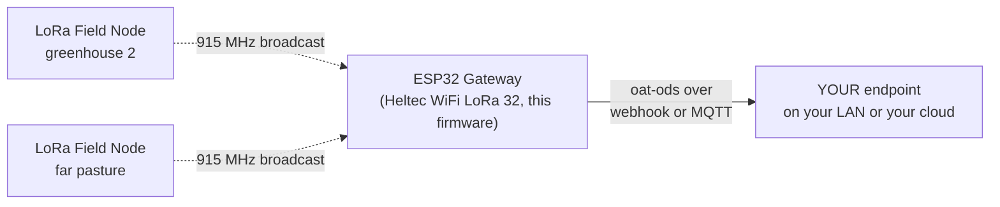

<p align="center">
  
</p>

<p align="center"><em><a href="https://openagriculturetechnology.com/">Open Agriculture Technology</a> is an open collective around one idea:<br>
appropriate technology for growing things — the right tool for the need, the budget, and the environment.</em></p>

<h1 align="center">OAT LoRa Gateway</h1>

<p align="center"><strong>The far-field twin of the BLE Listener: hears every LoRa Field Node on the property and lands their readings in a place you own.</strong><br>
One sketch in the <a href="../">OAT Sketch Library</a> — they all share one setup flow and push the same open
<a href="https://openagriculturetechnology.com/standard/">oat-ods</a> format to an endpoint you own.</p>

<p align="center">
  
  
  
  
  
  
  <a href="https://openagriculturetechnology.com/build/sketches/lora-gateway/"></a>
</p>

---

**Flash this sketch onto an ESP32 with a LoRa radio — a Heltec WiFi LoRa 32 —
and the board becomes a LoRa gateway.** The node hosts its own setup page: join
its Wi-Fi and configure everything in your browser — no app, no account, no code
editing. It sits where Wi-Fi lives, listens on a private 915 MHz channel for
every [OAT LoRa Field Node](../oat-lora-field-node/) on the property, gives each
field sensor its own stream under that sensor's own factory id, and pushes the
readings to an endpoint you own, by webhook or MQTT. No LoRaWAN, no network
server, no subscription: a field node is to this gateway what a Bluetooth
thermometer is to the [BLE Listener](../oat-ble-listener/) — a thing that
broadcasts a few dozen bytes on a schedule and never expects a reply. A live
[Test Endpoint](https://iot-test.openagriculturetechnology.com/) is ready to
catch your first reading ([Set it up](#set-it-up), step 5).



Every OAT sketch shares one core: the same setup page and captive portal, the
same Wi-Fi flow, the same push engine (HTTPS-preferred, HMAC-signed, batched),
the same 60-second health heartbeat, and the same two-way USB console. **Set up
one OAT node and you have set up all of them** — only the radio read differs.

**[Flash it from the browser](https://openagriculturetechnology.com/build/sketches/lora-gateway/)** —
the site page installs it over USB via ESP Web Tools (Chrome or Edge), and the
node's own setup page handles the rest. No IDE needed — or build from source
(below), if that's more your speed.

## How it works

1. A field node reads its sensors and broadcasts one small binary frame on the
   shared channel — an 11-byte header, 4 bytes per reading, CRC-16. The whole
   over-air contract is one header file: [`oat_lora_frame.h`](../lib/oat_lora/oat_lora_frame.h).
2. The gateway's radio sits in continuous receive. A frame that passes the
   magic, version and CRC checks is decoded; anything foreign on the channel is
   dropped and counted.
3. A **roster** frame (sent by each node at boot and every fifth cycle) maps the
   node's one-byte sensor tags to full hardware ids. A **data** frame carries
   readings by tag. The gateway files each reading under the id the wired
   sketch for that part would have used — `ds18b20:<rom>`, `sht30:<serial>`,
   `<node>:a<pin>` — so a probe moved from a Wi-Fi node keeps its series.
4. On the gateway's own timer it pushes one signed batch of folded readings to
   your endpoint, exactly as every OAT gateway does.

There is no acknowledgement and no downlink. The channel is a private radio LAN
with the manners of UDP, and this board is the bridge from that LAN to your
network. Loss is visible, not hidden: each node's lost-frame count is on the
status page, derived from the sequence numbers.

## Set it up

1. **Flash from the browser** at the
   [sketch's site page](https://openagriculturetechnology.com/build/sketches/lora-gateway/)
   (Chrome or Edge, ESP Web Tools) — or build it yourself (see Build, below).
   Pick the button for **your exact board**: a V4 flashed with the V3 image boots,
   says "radio ok", and hears nothing, because its radio front end stays
   unpowered. Attach the antenna to the **LoRa** u.FL (not the Wi-Fi one) before
   power.
2. Join the node's own Wi-Fi (`OAT-Setup-…`) and its setup page walks you
   through Wi-Fi, delivery (webhook URL **or** MQTT), and naming.
3. Leave the four **radio plan** fields at their defaults unless you changed
   them on the nodes: 915.0 MHz · 125 kHz · spreading factor 7 · sync word `12`.
   They must match the field nodes exactly or nothing is heard.
4. Watch **Field nodes heard** on the same page. A node appears on its next
   cycle (three minutes by default) with its sensor count, signal, battery and
   cadence; type `tx` on a node's console to hurry it along.
5. **Watch it land.** Point the gateway at the live
   [Open Agriculture Technology Test Endpoint](https://iot-test.openagriculturetechnology.com/) —
   enter `https://iot-test.openagriculturetechnology.com/ingest` as the endpoint
   URL. (The push engine is HTTPS-preferred; if TLS ever won't fit the chip's
   memory it falls back to signed HTTP on its own — the oat1 signature keeps
   even that safe. You just enter the URL.) Then open the console and pick your
   farm — the gateway name you set at setup: **your gateway and every field
   sensor it has heard are there, live** — readings, charts, heartbeat. No
   account, no registration; showing up in the data is the registration. It's a
   proof-of-life bench (readings are kept about an hour): prove your chain
   works, then point the gateway at an endpoint you keep. Want a per-message
   schema verdict instead? The
   [conformance sandbox](https://openagriculturetechnology.com/standard/test-endpoint/)
   checks every POST against the standard.

## Boards

| Board | Chip · radio | Status | Notes |
|---|---|---|---|
| Heltec WiFi LoRa 32 **V4** | ESP32-S3 · SX1262 + RF front end (PA/LNA) | **tested** — a field node's probe reading crossed the air and landed at the endpoint | The front end is powered, detected (GC1109 or KCT8103L) and driven around each transmit. Its on-screen dBm is chip-referenced, about 17 dB stronger than at the antenna. |
| Heltec WiFi LoRa 32 **V3** | ESP32-S3 · SX1262 | beta — boots, radio ok | 1.8 V TCXO and DIO2 RF switch configured. |
| Heltec WiFi LoRa 32 **V2 / V2.1** | ESP32 (classic) · SX1276 | beta — boots, radio ok | The classic chip's RAM holds a smaller table: 12 nodes × 24 sensors. CP2102 USB, may need a driver. |

*Tested* means a reading reached the endpoint on that board. Booting is not
testing, and "radio ok" is not testing.

## What it sends

Every field sensor is its own stream, named by the sensor's own hardware id,
plus one stream per node carrying the gateway's measurement of that node:

| stream | measurement | unit | fold |
|---|---|---|---|
| `ds18b20:<rom>` | `temperature` | `Cel` | mean |
| `sht30:<serial>` | `temperature`, `humidity` | `Cel`, `%RH` | mean |
| `<node>:a<pin>` | `light_level` or `soil_moisture`, plus `analog_raw` | `%`, mV | mean |
| `<pod stream>` | whatever a cabled pod printed, under its own id | as printed | by kind |
| `<node>` | `rssi`, `snr`, `voltage`, `mains`, `uptime` | `dBm`, `dB`, `V`, —, `s` | last |

```json
{
  "stream": "ds18b20:28ff640e91160349",
  "measurement": "temperature",
  "value": 21.4,
  "unit": "Cel",
  "agg": { "window_s": 300, "samples": 2, "method": "mean" },
  "source": { "physical_id": "ds18b20:28ff640e91160349", "brand": "Analog Devices",
              "model": "DS18B20", "rssi": -87, "battery_pct": 92 }
}
```

This is [**oat-ods**](https://openagriculturetechnology.com/standard/); the full
contract — batch envelope, field tables,
[JSON Schema](https://openagriculturetechnology.com/standard/oat-ods-0.3.schema.json),
sample payloads — lives in the
[developer reference](https://openagriculturetechnology.com/standard/reference/).
Measurement names and units come from the shared
[measurand vocabulary](https://openagriculturetechnology.com/standard/reference/),
so your endpoint cannot tell a LoRa probe from a wired one.

## The parts that matter

- **The gateway names nothing.** Stream ids are hardware ids; your endpoint owns
  the hardware-to-place map, where it survives a reflash and can be edited
  without visiting the node.
- **A silent node is an absence, not a frozen value.** Each node announces its
  cadence in every frame. After three silent cadences the gateway releases that
  node's streams; the next frame files straight back in.
- **Rosters survive a reboot.** Each node's tag-to-id map is kept in the
  gateway's flash, so a gateway restart does not go deaf for five node cycles
  waiting for the next roster. A node's own stream (its unit id) never needs one.
- **Never a placeholder id.** Readings for a tag with no roster entry yet are
  counted ("waiting for roster" on the status page), not filed. A stream created
  under a made-up id would split the series the moment the real id arrived.
- **The pod port.** A board cabled to the gateway's second serial port that
  prints readings in the [oat-line grammar](https://openagriculturetechnology.com/build/sketches/lora-field-node/#pod)
  files its streams here directly, with no radio in between — a
  [Weather-Station Listener](../oat-weather-listener/) on the same porch, a field
  node on the bench, an Apogee meter. Three wires at 115200 baud; the pins are
  fields on the setup page (RX 40 / TX 41 on a V3, 47 / 48 on a V4, 17 / 23 on a
  V2; `-1` switches it off). Cabled streams get their own table and are released
  after ten silent minutes.
- **The screen.** The board's OLED shows the gateway's name, its Wi-Fi address
  (or the setup network), nodes heard with frame and rejected counts, the last
  node's id and signal, the last push and whether it landed, and the radio plan.
  A range walk is a one-person job: carry a node away and watch the dBm fall.
- **Diagnosing silence.** On the console, `nodes` lists every node with its
  sensors, signal, loss and the radio interrupt count; `rssi` prints the chip's
  live signal level for five seconds. Have a node `tx` meanwhile: if the level
  jumps by tens of dB, radio energy is reaching the board and the plan is the
  question; if it never moves with both antennas on, the antenna path is.
- **A gateway is one place the farm can fail.** Put it on the same small
  battery back-up as the router. Its own 60-second heartbeat tells your endpoint
  whether the gateway or the farm went quiet.

## Placement, range and how many

**High and central.** The antenna's height matters more than any setting in
the firmware. A mast on the house or barn with the antenna in clear air will
hear a node a kilometre away at the default plan; the same board on a
windowsill may not hear the far greenhouse.

**How many nodes.** This build tracks 16 nodes and 64 sensors on the S3 boards
(12 × 24 on a V2), set by `-DOAT_MAX_UNITS` / `-DOAT_MAX_SUBS` / `-DOAT_MAX_SLOTS`
in `platformio.ini`. At the default plan a node's frame costs about a tenth of
a second of airtime, so a hundred nodes on a three-minute cadence would still
use under a tenth of the channel.

**Farther nodes.** A slower spreading factor reaches farther and costs more
airtime, and every node on a gateway must share the gateway's plan. For a mix
of near and far, run a second gateway on the far plan: each gateway hears one
plan at a time. The full airtime arithmetic, and why the design stopped short
of a mesh, is on the
[sketch's site page](https://openagriculturetechnology.com/build/sketches/lora-gateway/).

## Files

| File | What it is |
|---|---|
| `oat_lora_gateway.ino` | The firmware source (Arduino / ESP32): the radio and the frame decode, nothing else. |
| `platformio.ini` | Three envs — `heltec-v4`, `heltec-v3`, `heltec-v2` — with per-board table sizes. Pinned libs. |
| `merge_bin.py` | Post-build hook → one **merged factory image** per env at `out/firmware-<env>.bin`, flashable at offset 0. |
| `make_manifest.py` | Assembles `manifest.json` + one `manifest-<env>.json` per board. |
| `build.sh` | Builds, then copies bins + manifests + source downloads into the site assets. |
| `docker-build.sh` | The same compile with no host toolchain (Docker + PlatformIO). |
| [`../lib/oat_lora/`](../lib/oat_lora/) | The over-air frame + codebook, the RadioLib wrapper with the three boards' pin maps, the OLED helper. Shared with the field node. |

## Build

**You don't need this section to use the gateway** — it flashes from the
browser on [its site page](https://openagriculturetechnology.com/build/sketches/lora-gateway/).
Building it yourself:

```bash
pipx install platformio        # or: pip install --user platformio
./build.sh                     # all three boards
```

No host toolchain?

```bash
./docker-build.sh "-e heltec-v4"   # one board, compiled in Docker
SKIP_BUILD=1 ./build.sh            # then the asset steps
```

Images are named by env, not by chip, because the V3 and V4 are both ESP32-S3
and a browser installer cannot tell them apart. `build.sh` produces the merged,
flash-at-offset-0 images in `out/` plus the manifests the site's
flash-from-browser page serves.

## FAQ

**Is this LoRaWAN?**
No. LoRaWAN needs a network server, join keys and, in practice, a subscription
or a hosted stack. This is plain LoRa on a private channel: field nodes
broadcast, one gateway listens, and the readings go where you point them. If
you already run a LoRaWAN network, this is not for you; if you own one farm and
one house with Wi-Fi, it is.

**Why does the gateway hear nothing?**
In order: the four radio-plan fields must match the nodes exactly; the antenna
must be on the LoRa connector, not the Wi-Fi one; and a Heltec V4 must be
running the V4 image, not the V3 one. Then use `rssi` on the console while a
node transmits — it splits "no radio energy arrives" from "frames arrive and
fail".

**Can I mix near and far nodes?**
Only on the same plan. A gateway hears one spreading factor at a time, so a
far node on a slower plan needs a second gateway. Two gateways on two sync
words can share one house.

**What if the farm is bigger than the table?**
Raise the three table constants in `platformio.ini` and rebuild, or run a
second gateway. A campus with dozens of buildings is where a LoRaWAN
concentrator, which hears every spreading factor at once, starts to earn its
cost.

**Why do a V4 and a V3 show different dBm for the same link?**
The V4 has a low-noise amplifier ahead of its radio chip and reports what the
chip sees, roughly 17 dB above the antenna. Comfortable is about −75 on a V4
and −90 on a V2 or V3; the edge is about −105 and −120. Compare like with like
on a range walk.

## Related

- [`oat-lora-field-node/`](../oat-lora-field-node/) — the other half: the board in the field.
- [`oat-weather-listener/`](../oat-weather-listener/) — a listener that can ride this gateway's pod port.
- [`oat-ble-listener/`](../oat-ble-listener/) — the model this gateway follows, on Bluetooth.
- [`../lib/oat_lora/`](../lib/oat_lora/) — the over-air contract and the radio pin maps.
- [`../lib/oat_node_core/`](../lib/oat_node_core/) — the shared node core (config, Wi-Fi, portal, push engine).
- [The oat-ods standard](https://openagriculturetechnology.com/standard/reference/) — the wire format.

---
*Code: Apache-2.0 · Docs: CC BY 4.0 · An [OAT](https://openagriculturetechnology.com/) sketch — an OpenCDC initiative.*
