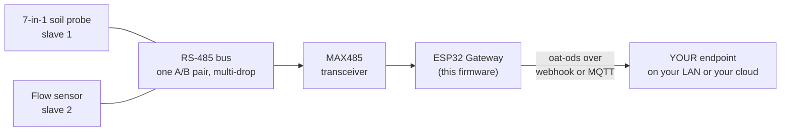

<p align="center">
  
</p>

<p align="center"><em><a href="https://openagriculturetechnology.com/">Open Agriculture Technology</a> is an open collective around one idea:<br>
appropriate technology for growing things — the right tool for the need, the budget, and the environment.</em></p>

<h1 align="center">OAT Modbus / RS-485 Reader</h1>

<p align="center"><strong>Bring industrial Modbus sensors — rugged, multi-drop, long-run — into a grower's own data lake.</strong><br>
One sketch in the <a href="../">OAT Sketch Library</a> — they all share one setup flow and push the same open
<a href="https://openagriculturetechnology.com/standard/">oat-ods</a> format to an endpoint you own.</p>

<p align="center">
  
  
  
  
  <a href="https://openagriculturetechnology.com/build/sketches/modbus-reader/"></a>
</p>

---

**Flash this sketch onto an ESP32 and the board becomes a Modbus gateway.**
The node hosts its own setup page: join its Wi-Fi and configure everything in
your browser — no app, no account, no code editing. Industrial sensors speak
**Modbus over RS-485**: rugged, multi-drop, good over long noisy cable runs;
this gateway reads their registers and pushes each as oat-ods — the bridge
from the factory-floor bus into data you own. A live
[Test Endpoint](https://iot-test.openagriculturetechnology.com/) is ready to
catch your first reading ([Setup](#setup), step 4). The site's
[reading sensor outputs guide](https://openagriculturetechnology.com/technology/reading-sensor-outputs/)
walks all five ways an ESP32 reads industrial sensors, Modbus included.



<p align="center"></p>

## The register map

Modbus registers are bare numbers, so you describe them on the setup page, one
line per slave:

```
<slave> <stream_id> <reg>:<type>:<measure>:<unit>:<scale>,...
```

- `type`: `h` = holding register, `i` = input register
- `scale`: multiplies the raw **signed 16-bit** value (default 1)

Examples:

```
1 gh2-env  0:i:temperature:Cel:0.1,1:i:humidity:%RH:0.1
2 gh2-flow 100:h:flow:l/min:0.1
```

Each register → one oat-ods message: `stream` = stream_id,
`physical_id` = `modbus:<slave>:<reg>`, `value` = `(int16)raw × scale`.
Measurement names and units come from the shared
[measurand vocabulary](https://openagriculturetechnology.com/standard/reference/) —
using them keeps your data portable across every OAT tool and endpoint.

```json
{
  "stream": "gh2-env",
  "measurement": "temperature",
  "value": 23.4,
  "unit": "Cel",
  "source": { "physical_id": "modbus:1:0" }
}
```

This is [**oat-ods**](https://openagriculturetechnology.com/standard/); the full
contract — batch envelope, field tables,
[JSON Schema](https://openagriculturetechnology.com/standard/oat-ods-0.3.schema.json),
sample payloads — lives in the
[developer reference](https://openagriculturetechnology.com/standard/reference/).

## Wiring

An RS-485 transceiver on a hardware UART: **RX**, **TX**, and — for a MAX485 — a
**DE/RE** direction pin (set it on the setup page; use **-1** for an
auto-direction module). Match the slave's **baud** (default 9600) and 8N1. RS-485
is multi-drop: wire many slaves on one A/B pair.

## Setup

1. Flash (see Build, below), or `pio run -t upload`.
2. Join the node's `OAT-Modbus-xxxx` Wi-Fi, open the setup page (admin / `oatsetup`).
3. Set Wi-Fi + delivery (webhook URL **or** MQTT), the RS-485 pins/baud, and the
   **register map**. Save & reboot.
4. **Watch it land.** Point the node at the live
   [Open Agriculture Technology Test Endpoint](https://iot-test.openagriculturetechnology.com/) —
   enter `https://iot-test.openagriculturetechnology.com/ingest` as the endpoint
   URL. (The push engine is HTTPS-preferred; if TLS ever won't fit the chip's
   memory it falls back to signed HTTP on its own — the oat1 signature keeps
   even that safe. You just enter the URL.) Then open the console
   and pick your farm — the gateway name you set at setup: **your gateway and
   its sensors are there, live** — readings, charts, heartbeat. No account, no
   registration; showing up in the data is the registration. It's a
   proof-of-life bench (readings are kept about an hour): prove your chain
   works, then point the node at an endpoint you keep. Want a per-message
   schema verdict instead? The
   [conformance sandbox](https://openagriculturetechnology.com/standard/test-endpoint/)
   checks every POST against the standard.

## Build & flash

```bash
pipx install platformio          # or: pip install --user platformio
cd oat-modbus-reader
./build.sh
```

This is a **source release**: it compiles against the pinned deps but hasn't
earned the bench-verified badge the live sketches carry — build it, flash it, and
prove it on your bench before you trust it in the field. Deps (pinned in
`platformio.ini`): `4-20ma/ModbusMaster`, `PubSubClient`, `ArduinoJson`, and the
local `oat_ods` module.

Rather download than clone? The
[sketch's site page](https://openagriculturetechnology.com/build/sketches/modbus-reader/)
offers the `.ino` and the full project zip. When compiled images publish, that
page gains a **flash-from-the-browser Install button** — the
[live sketches](https://openagriculturetechnology.com/build/sketches/) have one
today, no toolchain needed.

## Notes (v1)

- Reads one register per transaction (simple + robust); 32-bit / float registers
  and block reads are a future rev.
- Values are treated as **signed int16 × scale**; for unsigned-only sensors, the
  scale still applies (watch the sign on values > 32767).

## FAQ

**How do I read a Modbus RTU sensor with an ESP32?**
Add an RS-485 transceiver (such as a MAX485) to a hardware UART on the ESP32 and
use a Modbus master library to read holding or input registers. Because registers
are bare numbers, you map each register to a measurement, unit, and scale factor,
so the reading becomes value = raw × scale.

**What is RS-485 and why use it for sensors?**
A rugged, differential serial bus that works over long, electrically noisy cable
runs and supports many devices on one pair of wires (multi-drop). It's the common
physical layer for Modbus RTU industrial sensors, which suits spread-out
greenhouse or farm installations where short-range buses fail.

## Related

- [`oat-sdi12-reader/`](../oat-sdi12-reader/) — the other industrial-bus bridge (research-grade SDI-12 instruments).
- [`../lib/oat_ods/`](../lib/oat_ods/) — the shared oat-ods encoder + measurand vocabulary.
- [The oat-ods standard](https://openagriculturetechnology.com/standard/) — the wire format.

> **Shared core:** this sketch carries its own copy of the config / Wi-Fi /
> delivery scaffolding; as the shared `oat-node-core` library is adopted, only the
> acquisition layer stays sketch-specific.

---
*Code: Apache-2.0 · Docs: CC BY 4.0 · An [OAT](https://openagriculturetechnology.com/) sketch — an OpenCDC initiative.*
