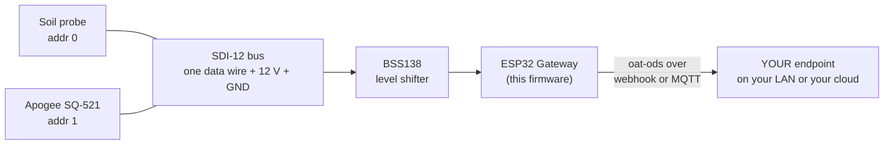

<p align="center">
  
</p>

<p align="center"><em><a href="https://openagriculturetechnology.com/">Open Agriculture Technology</a> is an open collective around one idea:<br>
appropriate technology for growing things — the right tool for the need, the budget, and the environment.</em></p>

<h1 align="center">OAT SDI-12 Reader</h1>

<p align="center"><strong>Land research-grade SDI-12 instruments — soil, water, weather probes — straight in your own data lake.</strong><br>
One sketch in the <a href="../">OAT Sketch Library</a> — they all share one setup flow and push the same open
<a href="https://openagriculturetechnology.com/standard/">oat-ods</a> format to an endpoint you own.</p>

<p align="center">
  
  
  
  
  <a href="https://openagriculturetechnology.com/build/sketches/sdi12-reader/"></a>
</p>

---

Professional [soil, water, and weather instruments](https://openagriculturetechnology.com/technology/research-grade-sensors/)
speak **SDI-12**, the open digital bus that usually needs a costly datalogger. This node reads them directly
— Apogee SQ-521, soil/water probes, weather sensors — and pushes each value to
your endpoint by **webhook or MQTT**, no proprietary logger required. Reuses the
shared [`oat_ods`](../lib/oat_ods/) encoder.



<p align="center"></p>

## The sensor map

SDI-12 returns bare numbers — it doesn't say what they mean. So you tell the node,
on its setup page, one line per sensor:

```
<addr> <stream_id> <measure1>:<unit1>,<measure2>:<unit2>,...
```

Examples:

```
0 gh2-soil   moisture:%,temperature:Cel,ec:dS/m
1 canopy-par par:umol/m2/s
```

The node polls each address (`aM!` then `aD0!…`) and maps the returned values, in
order, to your labels. Each value becomes one oat-ods message: `stream` = your
`stream_id`, `physical_id` = `sdi12:<addr>`, `measurement`/`unit` = your labels.
Don't know the addresses? The setup page has a **Scan the bus** helper that
queries `aI!` on addresses 0–9 and shows what answers.

Measurement names and units come from the shared
[measurand vocabulary](https://openagriculturetechnology.com/standard/reference/) —
using them keeps your data portable across every OAT tool and endpoint.

## Wiring

SDI-12 is one data wire (plus power + ground). The data line is **5 V** logic
(it idles low; signals swing to 5 V) and the ESP32 is 3.3 V, so put a
**level interface** on the data line for reliable reads. One channel of the
ubiquitous **BSS138 4-channel logic-level converter board** (a dollar or two,
in most starter kits) does the job:

| Level-shifter pin | Connects to |
|---|---|
| LV | ESP32 **3V3** |
| HV | **5 V** (the ESP32 board's 5V / USB pin) |
| GND (both sides) | Common ground — ESP32 *and* sensor |
| LV1 | ESP32 data GPIO (default **16**) |
| HV1 | The SDI-12 **data wire** |

Many sensors also want **12 V** on their power line — separate from the ESP32's
supply, sharing only ground. Set the data GPIO on the setup page (default 16). The site's
[reading sensor outputs guide](https://openagriculturetechnology.com/technology/reading-sensor-outputs/)
walks all five ways an ESP32 reads industrial sensors, SDI-12 included.

## Setup

1. Flash from the browser (see Build, below), or `pio run -t upload`.
2. Join the node's `OAT-SDI12-xxxx` Wi-Fi, open the setup page (admin / `oatsetup`).
3. Set Wi-Fi + delivery (webhook URL **or** MQTT), the SDI-12 data pin, the poll
   interval, and the **sensor map**. Save & reboot.
4. **Watch it land.** Point the node at the live
   [Open Agriculture Technology Test Endpoint](https://iot-test.openagriculturetechnology.com/) —
   enter `https://iot-test.openagriculturetechnology.com/ingest` as the endpoint
   URL. (The push engine is HTTPS-preferred; if TLS ever won't fit the chip's
   memory it falls back to signed HTTP on its own — the oat1 signature keeps
   even that safe. You just enter the URL.) Then open the console
   and pick your farm — the gateway name you set at setup: **your gateway and
   its sensors are there, live** — readings, charts, heartbeat. No account, no
   registration; showing up in the data is the registration. It's a
   proof-of-life bench (readings are kept about an hour): prove your chain
   works, then point the node at an endpoint you keep. Want a per-message
   schema verdict instead? The
   [conformance sandbox](https://openagriculturetechnology.com/standard/test-endpoint/)
   checks every POST against the standard.

## Build & flash

```bash
pipx install platformio          # or: pip install --user platformio
cd oat-sdi12-reader
./build.sh          # builds all chip families, assembles the web-installer payload
```

This is a **source release**: it compiles against the pinned deps but hasn't
earned the bench-verified badge the live sketches carry — build it, flash it, and
prove it on your bench before you trust it in the field. Deps (pinned in
`platformio.ini`): `EnviroDIY/SDI-12`, `knolleary/PubSubClient`,
`bblanchon/ArduinoJson`, and the local `oat_ods` module.

Rather download than clone? The
[sketch's site page](https://openagriculturetechnology.com/build/sketches/sdi12-reader/)
offers the `.ino` and the full project zip. When compiled images publish, that
page gains a **flash-from-the-browser Install button** — the
[live sketches](https://openagriculturetechnology.com/build/sketches/) have one
today, no toolchain needed.

## What a reading looks like

```json
{
  "stream": "gh2-soil",
  "measurement": "soil_moisture",
  "value": 34.2,
  "unit": "%",
  "source": { "physical_id": "sdi12:0" }
}
```

The endpoint can't tell a $600 SDI-12 instrument from a $20 sensor — it's all one
stream of owned data. This is [**oat-ods**](https://openagriculturetechnology.com/standard/);
the full contract — batch envelope, field tables,
[JSON Schema](https://openagriculturetechnology.com/standard/oat-ods-0.3.schema.json),
sample payloads — lives in the
[developer reference](https://openagriculturetechnology.com/standard/reference/).

## Notes & limits (v1)

- Polls the addresses you list in the map (no auto-poll of the whole bus).
- The measurement wait (`aM!` stated seconds) is a blocking delay, capped at 30 s;
  typical sensors answer in 1–3 s. A future rev can watch for the service-request
  line instead of waiting.
- Provenance is `sdi12:<addr>`; a future rev can enrich it from `aI!`
  (vendor/model/serial).
- Emits the **same oat-ods** the BLE listener and Home Assistant do — one owned
  stream regardless of what the sensor cost.

## FAQ

**How do I read an SDI-12 sensor without a datalogger?**
An ESP32 with an SDI-12 library can act as the SDI-12 recorder itself: it
addresses each sensor, issues a measure command, and reads back the values.
Because SDI-12 signals swing to 5 V, a small level interface protects the 3.3 V
microcontroller.

**What sensors use SDI-12?**
It's the digital bus common on research-grade environmental instruments: soil
moisture and water-content probes, water-quality sensors, and some weather and
radiation sensors such as the Apogee SQ-521. Several sensors share one data wire,
each at its own address.

**Can I use an RS-485 or RS-232 converter board instead of a level shifter?**
No. An RS-485 board (MAX485) puts a differential pair on the wire, and SDI-12 is
a single-ended one-wire bus, so the sensor never hears it — keep that board for
the [Modbus / RS-485 Reader](../oat-modbus-reader/). An RS-232 board is closer in
spirit but drives negative voltage onto the bus and can't release the shared wire
for the sensor to answer. The board that works is the common BSS138 logic-level
converter: one channel on the data line shifts 3.3 V to 5 V both ways — the
exact hookup is in [Wiring](#wiring), above.

## Related

- [`oat-modbus-reader/`](../oat-modbus-reader/) — the other industrial-bus bridge (RS-485 / Modbus RTU).
- [`../lib/oat_ods/`](../lib/oat_ods/) — the shared oat-ods encoder + measurand vocabulary.
- [The oat-ods standard](https://openagriculturetechnology.com/standard/) — the wire format.

> **Shared core:** this sketch carries its own copy of the config / Wi-Fi /
> delivery scaffolding; as the shared `oat-node-core` library is adopted, only the
> acquisition layer stays sketch-specific.

---
*Code: Apache-2.0 · Docs: CC BY 4.0 · An [OAT](https://openagriculturetechnology.com/) sketch — an OpenCDC initiative.*
