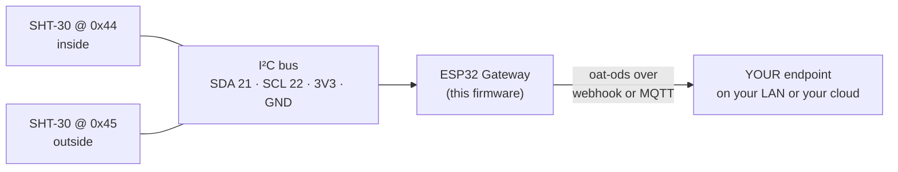

<p align="center">
  
</p>

<p align="center"><em><a href="https://openagriculturetechnology.com/">Open Agriculture Technology</a> is an open collective around one idea:<br>
appropriate technology for growing things — the right tool for the need, the budget, and the environment.</em></p>

<h1 align="center">OAT SHT-30 Temperature &amp; Humidity Node</h1>

<p align="center"><strong>Four wires and an accurate air sensor, reporting to a place you own.</strong><br>
One sketch in the <a href="../">OAT Sketch Library</a> — they all share one setup flow and push the same open
<a href="https://openagriculturetechnology.com/standard/">oat-ods</a> format to an endpoint you own.</p>

<p align="center">
  
  
  
  
  
  <a href="https://openagriculturetechnology.com/build/sketches/sht30-node/"></a>
</p>

---

A self-configuring ESP32 node that reads an **SHT-30** air temperature + humidity
sensor over I²C and pushes the readings as **oat-ods** to an endpoint the grower
owns, by webhook or MQTT. The SHT-30 has exactly two addresses, so one board can
carry two sensors — inside and outside from one node.



<p align="center"></p>

Every OAT sketch shares one core: the same setup page and captive portal, the
same Wi-Fi flow, the same push engine (HTTPS-preferred, HMAC-signed, batched),
the same 60-second health heartbeat, and the same two-way USB console. **Set up
one OAT node and you have set up all of them** — only the sensor read differs.

**[Flash it from the browser](https://openagriculturetechnology.com/build/sketches/sht30-node/)** —
the site page installs it over USB via ESP Web Tools (Chrome or Edge), and the
node's own setup page handles the rest. No IDE needed — or build from source
(below), if that's more your speed.

## Wiring (classic ESP32)

| SHT-30 | ESP32 |
|---|---|
| VIN / VCC | **3V3** (not 5 V unless the breakout regulates) |
| GND | GND |
| SDA | **GPIO 21** |
| SCL | **GPIO 22** |
| ADDR | open = `0x44` · tied to 3V3 = `0x45` (a second sensor) |

**Why 21 and 22.** GPIO 6–11 are the SPI flash the firmware runs from. GPIO
0/2/12/15 are strapping pins, and an I²C bus idles high through its pull-ups,
which is exactly the pull that flips one into the wrong boot mode. GPIO 1/3 are
UART0, the USB console. GPIO 34–39 are input-only with no pull-ups, so they can
never carry a bidirectional bus. GPIO 16/17 are free on a plain devkit but are the
PSRAM lines on WROVER modules and are already spent by the other sketches in this
library (SDI-12 data, Modbus RX/TX, HX711). That leaves **21/22**, which are also
the ESP32 core's default `Wire` pins and what the two other I²C sketches here
(Analog Reader, CWSI Node) default to. One wiring habit for the whole library.
Both pins are configurable on the setup page for a board that differs.

**Pull-ups.** I²C needs a resistor pulling each line to 3.3 V. Nearly every SHT-30
breakout has them (typically 10 k); a bare chip does not — add 4.7 k–10 k.

## Set it up

1. **Flash from the browser** at the
   [sketch's site page](https://openagriculturetechnology.com/build/sketches/sht30-node/)
   (Chrome or Edge, ESP Web Tools) — or build it yourself (see Build, below).
2. Join the node's own Wi-Fi (`OAT-…`) and its setup page walks you through
   Wi-Fi, delivery (webhook URL **or** MQTT), pins, and naming.
3. Wire the sensor (below) — the node finds whichever addresses are present at
   boot, and picks up one wired later.
4. **Watch it land.** You're welcome to point delivery at OAT's live
   [test endpoint](https://openagriculturetechnology.com/standard/test-endpoint/) —
   a free public sandbox, no account needed. Open the page, pick a box name,
   paste the endpoint URL it gives you into the node's delivery field, and your
   readings appear on that page within seconds — parsed fields alongside the raw
   JSON, with a conformance verdict on every POST. It's the fastest proof the
   whole chain works, before you wire the node into anything real. (It's a
   shared sandbox: boxes are open by name and hold the last 50 readings, so pick
   a distinctive name and send nothing private.)

## What it reports

| measurement | unit | fold over the push window |
|---|---|---|
| `temperature` | `Cel` | mean |
| `humidity` | `%RH` | mean |

```json
{
  "stream": "greenhouse-inside",
  "measurement": "temperature",
  "value": 24.7,
  "unit": "Cel",
  "agg": { "window_s": 300, "samples": 10, "method": "mean" },
  "source": { "physical_id": "sht30:0x44" }
}
```

This is [**oat-ods**](https://openagriculturetechnology.com/standard/); the full
contract — batch envelope, field tables,
[JSON Schema](https://openagriculturetechnology.com/standard/oat-ods-0.3.schema.json),
sample payloads — lives in the
[developer reference](https://openagriculturetechnology.com/standard/reference/).

Dewpoint and VPD are **not** computed here. The node reports what it observed and
the endpoint derives the rest, the same rule every OAT node follows.

`source.physical_id` carries the chip's own serial number (`sht30:<serial>`), read
at boot — swappable provenance for "which gadget is filling this slot." A clone
breakout that doesn't implement the serial command falls back to `sht30:0x44`.

## The parts that matter

- **The sensor is read directly, no vendor library.** Six bytes and two CRCs; the
  driver is short enough to read in one sitting. Doing it here means the CRC is
  actually checked, the heater and status register are reachable, and there is one
  less pinned dependency between a grower and a working node.
- **CRC-checked, and a failed CRC is discarded, not reported.** A long or damp
  wire produces plausible-looking garbage; a wrong number is worse than a missing
  one. Counters (ok / failed / CRC) are on the status page and in `status`.
- **Bus recovery, including the wedged case.** After 5 consecutive failures the
  node rebuilds the I²C bus and soft-resets the sensor. The rebuild **clocks the
  line manually** until the sensor lets go, because a slave holding the data line
  low survives a plain release-and-retake and blocks every later transfer. It is
  rate-limited, and a node where *nothing* answers retries on a slow cadence — a
  never-answered slot is deliberately not counted as failing, so without that a
  bus wedged by a brownout would sit dead until someone power-cycled it.
- **A sensor that stops answering is dropped from the live view**, rather than left
  showing its last reading in live-value type. An hours-old number presented as
  current is its own kind of lie. The failure detail replaces it.
- **Two sensors, one node.** The SHT-30 has exactly two addresses, so `0x44` and
  `0x45` each get their own stream id. Inside and outside from one board. The node
  finds whichever are present at boot, and picks up one wired later.
- **Optional heater, with a confirmed off.** Off by default. For a sensor sitting
  in condensing air it pulses on a timer; samples during the pulse and for 30 s
  after are thrown away, because a heated sensor reads warm and dry. Turning it off
  is **verified against the status register**, not assumed: a heated SHT-30 answers
  perfectly well, it just answers wrong, so an off command that quietly NACKed on a
  damp connector would leave the node publishing plausible warm, dry fiction with
  no failure counter to catch it. If the heater bit will not clear after a retry and
  a soft reset, that sensor stops being read until it does.
- **`agg.window_s` is the window actually covered**, not the configured interval.
  Sampling continues while the network is down, so the first push after an outage
  can carry hours of readings, and it says so.
- **The pin fields are guarded.** SDA/SCL are settable, and a wrong value there is
  persisted and re-applied at every boot — setting SDA to a flash pin would take
  the board down before the setup page exists to fix it. The unusable pins (flash,
  input-only, strapping, UART0, not-brought-out) are refused with the reason.
- **Remote diagnosis.** When the sensor dies, the 60 s heartbeat keeps arriving
  while the readings stop. That contrast — alive but quiet — is what the endpoint
  watches, and it is why the heartbeat is sent before the sensor push.

## Files

| File | What it is |
|---|---|
| `oat_sht30_node.ino` | The firmware source (Arduino / ESP32). |
| `platformio.ini` | Build config. One env: classic ESP32. Pinned libs. |
| `merge_bin.py` | Post-build hook → one **merged factory image** at `out/firmware-esp32.bin`, flashable at offset 0. |
| `make_manifest.py` | Assembles `manifest.json` + `manifest-esp32.json` from whatever bins exist. |
| `build.sh` | Builds, then copies bins + manifests + source downloads into the site assets. |
| `docker-build.sh` | The same compile with no host toolchain (Docker + PlatformIO). |

## Build

**You don't need this section to use the node** — it flashes from the browser on
[its site page](https://openagriculturetechnology.com/build/sketches/sht30-node/).
Building it yourself:

```bash
pipx install platformio        # or: pip install --user platformio
./build.sh
```

No host toolchain?

```bash
./docker-build.sh              # compile in Docker
SKIP_BUILD=1 ./build.sh        # then the asset steps
```

`build.sh` produces the merged, flash-at-offset-0 image in `out/`, plus the
manifest and download bundle the OAT site's flash-from-browser page serves.

## One board on purpose

Every OAT sketch is split by **sensor, never by chip**, so adding the S3 / C3 / C6
later is an env in `platformio.ini` plus a default pin pair, not a second sketch.
The classic ESP32 is what shipped first here because it is the board this was cut
for and bench-run on. The pin guidance above is classic-ESP32 specific: the other
chips number their pins differently and each needs its own verified default pair
before it earns a button on the site.

## FAQ

**Can one node read inside and outside at once?**
Yes. The SHT-30 has exactly two I²C addresses — `0x44` (default) and `0x45`
(ADDR pin tied to 3V3) — so two sensors share one board and each gets its own
stream id. The node finds whichever are present at boot.

**Does it report dewpoint or VPD?**
No — deliberately. The node reports what it observed (temperature, humidity);
your endpoint derives dewpoint and VPD from them. Deriving downstream keeps
every derived value consistent and recomputable, and it's the rule every OAT
node follows.

**Why do my readings look warm and dry?**
Check the heater. The SHT-30 has an onboard heater for condensing environments;
a heated sensor answers perfectly well — it just answers wrong. This firmware
keeps it off by default, verifies "off" against the status register, and throws
away samples taken while it's on.

## Related

- [`oat-ble-listener/`](../oat-ble-listener/) — the reference node this core comes from.
- [`../lib/oat_ods/`](../lib/oat_ods/) — the shared oat-ods encoder + measurand vocabulary.
- [`../lib/oat_sign/`](../lib/oat_sign/) — the shared HMAC push signer.
- [The oat-ods standard](https://openagriculturetechnology.com/standard/reference/) — the wire format.

---
*Code: Apache-2.0 · Docs: CC BY 4.0 · An [OAT](https://openagriculturetechnology.com/) sketch — an OpenCDC initiative.*
