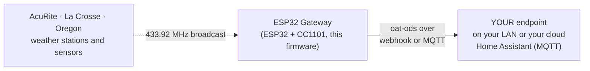

<p align="center">
  
</p>

<p align="center"><em><a href="https://openagriculturetechnology.com/">Open Agriculture Technology</a> is an open collective around one idea:<br>
appropriate technology for growing things — the right tool for the need, the budget, and the environment.</em></p>

<h1 align="center">OAT Weather-Station Listener</h1>

<p align="center"><strong>Hear the AcuRite, La Crosse or Oregon Scientific station you already own, and keep every reading.</strong><br>
One sketch in the <a href="../">OAT Sketch Library</a> — they all share one setup flow and push the same open
<a href="https://openagriculturetechnology.com/standard/">oat-ods</a> format to an endpoint you own.</p>

<p align="center">
  
  
  
  
  
  
  <a href="https://openagriculturetechnology.com/build/sketches/weather-station-listener/"></a>
</p>

---

**Flash this sketch onto an ESP32 with a five-dollar CC1101 radio and the board
becomes a weather-station gateway.** The node hosts its own setup page: join its
Wi-Fi and configure everything in your browser — no app, no account, no code
editing. It hears the one-way 433 MHz broadcasts of the consumer weather
stations and outdoor sensors a grower already owns — the AcuRite Iris (5-in-1),
Atlas and tower sensors, La Crosse, Oregon Scientific, the older Fine Offset
arrays — decodes them with the
[rtl_433](https://github.com/merbanan/rtl_433) project's decoders, maps every
value onto the OAT vocabulary, and pushes it to an endpoint you own, by webhook
or MQTT, or into [Home Assistant](https://openagriculturetechnology.com/home-assistant/weather-station/)
over MQTT (one topic per reading, declared in YAML). The [BLE Listener](../oat-ble-listener/)'s sibling, tuned to
the band where the outdoor sensors live. A live
[Test Endpoint](https://iot-test.openagriculturetechnology.com/) is ready to
catch your first reading ([Set it up](#set-it-up), step 4).



Every OAT sketch shares one core: the same setup page and captive portal, the
same Wi-Fi flow, the same push engine (HTTPS-preferred, HMAC-signed, batched),
the same 60-second health heartbeat, and the same two-way USB console. **Set up
one OAT node and you have set up all of them** — only the radio read differs.

**[Flash it from the browser](https://openagriculturetechnology.com/build/sketches/weather-station-listener/)** —
the site page installs it over USB via ESP Web Tools (Chrome or Edge), and the
node's own setup page handles the rest. No IDE needed — or build from source
(below), if that's more your speed.

## The decoders are not ours

They are the rtl_433 project's, ported to the ESP32 as
[rtl_433_ESP](https://github.com/NorthernMan54/rtl_433_ESP) (GPL-3.0): about
220 on-off-keying device types, refreshed from the rtl_433 tree. This sketch
wraps them as a driver on the OAT node core; the sketch itself is the map from
a decoder's JSON to the OAT vocabulary, and the station table. Nothing here
decodes a radio protocol, and nothing here should: a new station is a decoder
upstream, not a sketch release.

## Set it up

1. **Flash from the browser** at the
   [sketch's site page](https://openagriculturetechnology.com/build/sketches/weather-station-listener/)
   (Chrome or Edge, ESP Web Tools) — pick the button that matches your board
   and radio (table below) — or build it yourself (see Build, below).
2. Join the node's own Wi-Fi (`OAT-Setup-…`) and its setup page walks you
   through Wi-Fi, delivery (webhook URL **or** MQTT), and naming. Leave the
   **band** at 433.92; that is where AcuRite, La Crosse and Oregon Scientific
   broadcast. The radio hears one band at a time.
3. Watch **Stations heard** on the same page. Your station appears on its next
   broadcast with its model, signal and how long ago; give it a minute. A
   shared band includes the neighbours' stations — the optional **allow-list**
   takes the ids you see there and reports those alone.
4. **Watch it land.** Point the node at the live
   [Open Agriculture Technology Test Endpoint](https://iot-test.openagriculturetechnology.com/) —
   enter `https://iot-test.openagriculturetechnology.com/ingest` as the endpoint
   URL. (The push engine is HTTPS-preferred; if TLS ever won't fit the chip's
   memory it falls back to signed HTTP on its own — the oat1 signature keeps
   even that safe. You just enter the URL.) Then open the console and pick your
   farm — the gateway name you set at setup: **your gateway and every station it
   hears are there, live** — wind, rain, temperature, charts, heartbeat. No
   account, no registration; showing up in the data is the registration. It's a
   proof-of-life bench (readings are kept about an hour): prove your chain
   works, then point the node at an endpoint you keep. Want a per-message
   schema verdict instead? The
   [conformance sandbox](https://openagriculturetechnology.com/standard/test-endpoint/)
   checks every POST against the standard.

## Boards and radios

Images are named by env, not by chip, because two boards can share a chip
family and differ in the radio. The installer button on the site is captioned
by what the board is electrically.

| Env | Board | Radio | Status |
|---|---|---|---|
| `esp32` | ESP32 (classic) devkit | CC1101 — SCK 18 · MISO 19 · MOSI 23 · CS 5 · GDO0 22 · GDO2 4 · 3V3 · GND | beta |
| `esp32-s3` | ESP32-S3 devkit | CC1101 — SCK 12 · MISO 13 · MOSI 11 · CS 10 · GDO0 9 · GDO2 8 | beta |
| `esp32-c3` | ESP32-C3 devkit | CC1101 — SCK 4 · MISO 5 · MOSI 6 · CS 7 · GDO0 10 · GDO2 3 | beta |
| `esp32-c6` | ESP32-C6 devkit | CC1101 — SCK 6 · MISO 2 · MOSI 7 · CS 18 · GDO0 10 · GDO2 11 | beta |
| `heltec-v2` | Heltec WiFi LoRa 32 V2 | its own SX1276 — nothing to wire | beta |
| `heltec-v3` | Heltec WiFi LoRa 32 V3 | CC1101 on spare pins — SCK 5 · MISO 6 · MOSI 7 · CS 4 · GDO0 3 · GDO2 2 (the V3's SX1262 cannot demodulate OOK) | beta |
| `ibc-v102` | ESP32 (classic), a bare 433 MHz superheterodyne receiver, DATA on GPIO 33 | no transceiver: the sketch's own pulse decoder, AcuRite 5-in-1 only | **tested** — an AcuRite Iris decoded and landed at the endpoint |
| `ibc-v102-cc1101` | ESP32 (classic) + CC1101 on alternate pins — SCK 32 · MOSI 27 · MISO 35 · CS 25 · GDO0 33 · GDO2 36 | the full decoder set | beta |

*Tested* means a reading reached the endpoint on that board. The bare-receiver
path exists because a superheterodyne module has no signal level for the
rtl_433 library to gate on; it runs a sketch-local decoder for the AcuRite
5-in-1 (Iris) with rtl_433's pulse tolerances, and hands the fields to the same
map as every other path. A station must be within tens of metres of a bare
receiver; a CC1101 hears much farther.

The shipped images demodulate **OOK**. The Fine Offset family sold today as
Ecowitt and Ambient Weather (WS-2902 / WH65 arrays, WH51 soil, WH31 / WN34
probes, WH57 lightning, WH55 leak, WH41 / WH45 particulates, WS80 / WS90) is
**FSK on 915 MHz, every sensor of it**, and these images do not hear it. The
same source built with `-DOOK_MODULATION=false` links the FSK decoders, but
that build has not been proven on hardware, so it is not offered or claimed.
A radio cannot do both at once. A quarter-wave wire antenna is 17.3 cm at
433 MHz.

## What it sends

The station's own id is the stream id — `<model-slug>:<id>[-<channel>]`, e.g.
`acurite-5n1:748-A` — so the listener names nothing and your endpoint owns the
map from ids to places. A decoder's keys are mapped onto the shared vocabulary,
with the unit conversion built into the row (`wind_avg_km_h` → `wind_speed` in
m/s, `rain_in` → `rain_total` in mm, `temperature_F` → `temperature` in °C):

| measurement | unit | fold | from |
|---|---|---|---|
| `temperature`, `humidity` | `Cel`, `%RH` | mean | every station |
| `wind_speed`, `wind_gust`, `wind_direction` | `m/s`, `m/s`, `deg` | mean, max, last | anemometers |
| `rain_total`, `rain_rate` | `mm`, `mm/h` | cumulative, mean | rain gauges (see below) |
| `uv_index`, `illuminance`, `solar_radiation` | —, `lx`, `W/m2` | mean | arrays |
| `soil_moisture`, `leaf_wetness` | `%` | mean | mapped for the FSK build; no OOK station sends them |
| `lightning_total`, `lightning_distance` | —, `km` | cumulative, last | AcuRite Atlas |
| `pm25`, `pm10`, `co2`, `pressure`, `water_level` | `ug/m3`, `ppm`, `hPa`, `cm` | mean | mapped; OOK barometers and depth sensors where rtl_433 has them |
| `battery_low`, `water_leak` | — | state | every station; leak sensors where rtl_433 has them |
| `voltage`, `rssi` | `V`, `dBm` | last | where the decoder reports them |

Anything numeric the map does not know is forwarded **raw** under the decoder's
own key and listed on the status page so it can be promoted — nothing a station
measured is silently discarded. **`rain_total` is the station's running counter**
(an AcuRite reports tips of 0.01 in since its last battery pull): your endpoint
subtracts consecutive values for rainfall and treats a drop as a reset — the
rule is spelled out in the
[developer reference](https://openagriculturetechnology.com/standard/reference/).

```json
{
  "stream": "acurite-5n1:748-A",
  "measurement": "wind_speed",
  "value": 2.31,
  "unit": "m/s",
  "agg": { "window_s": 300, "samples": 16, "method": "mean" },
  "source": { "physical_id": "acurite-5n1:748-A", "brand": "AcuRite",
              "model": "Acurite-5n1", "rssi": -68 }
}
```

This is [**oat-ods**](https://openagriculturetechnology.com/standard/); the full
contract — batch envelope, field tables,
[JSON Schema](https://openagriculturetechnology.com/standard/oat-ods-0.3.schema.json),
sample payloads — lives in the
[developer reference](https://openagriculturetechnology.com/standard/reference/).

## The parts that matter

- **Two outputs, one firmware.** With Wi-Fi and an endpoint configured, this is
  an OAT gateway. With nothing configured it still prints every reading on the
  USB serial port in the oat-line grammar, so cabled to a
  [LoRa Field Node](../oat-lora-field-node/)'s pod port — or the
  [LoRa Gateway](../oat-lora-gateway/)'s — it is a pod: the station in the far
  field rides to the house over LoRa under the same stream ids. Same decoder,
  same ids; the difference is configuration.
- **A station that goes quiet is let go.** After ten silent minutes its stream
  is released and the row is marked silent; it files straight back in when
  heard again. A neighbour's sensor that drifted past, or a dead battery, never
  holds a slot for the life of the node.
- **No fake signal levels.** A bare receiver has no RSSI, so on that path the
  link metadata is left unset and the table shows a dash, rather than 0 dBm.
- **The band is a runtime setting.** Changing it re-initialises the receiver
  (the library owns the radio's task and buffers; `end()`/`begin()` is the one
  clean way to retune). A bare-receiver image's band is fixed by its module.
- **Home Assistant.** Point the node at your broker and declare each reading as
  an MQTT sensor in YAML (`oat/<name>/<station>/<measurement>`, value from
  `value_json.value`); the sketches send no discovery announcements. The
  [weather-station guide](https://openagriculturetechnology.com/home-assistant/weather-station/)
  covers three routes, including stations that only talk to their own hub.

## Files

| File | What it is |
|---|---|
| `oat_weather_listener.ino` | The firmware source (Arduino / ESP32): the vocabulary map, the station table, the bare-receiver decoder. |
| `platformio.ini` | Eight envs (four devkits, two Heltecs, two bare-receiver variants). Pinned libs (rtl_433_ESP, RadioLib, ArduinoLog). |
| `merge_bin.py` | Post-build hook → one **merged factory image** per env at `out/firmware-<env>.bin`, flashable at offset 0. |
| `make_manifest.py` | Assembles `manifest.json` + one `manifest-<env>.json` per board. |
| `build.sh` | Builds, then copies bins + manifests + source downloads into the site assets. |
| `docker-build.sh` | The same compile with no host toolchain (Docker + PlatformIO). |

## Build

**You don't need this section to use the node** — it flashes from the browser
on [its site page](https://openagriculturetechnology.com/build/sketches/weather-station-listener/).
Building it yourself:

```bash
pipx install platformio        # or: pip install --user platformio
./build.sh                     # every env
```

No host toolchain?

```bash
./docker-build.sh "-e esp32"   # one env, compiled in Docker
SKIP_BUILD=1 ./build.sh        # then the asset steps
```

Two build facts worth knowing: rtl_433_ESP names the SPI bus `VSPI` on chips it
does not list, so the C6 env aliases it (`-DVSPI=FSPI`); and the library needs a
transceiver it can read RSSI from (CC1101, SX127x) — a bare receiver on a data
pin gets the sketch-local decoder path (`-DOAT_RX_DATAPIN=<gpio>`) with
rtl_433_ESP not linked.

## FAQ

**Which weather stations does it hear?**
Any OOK station rtl_433 decodes: AcuRite Iris, Atlas and tower sensors, La
Crosse, Oregon Scientific, Bresser, TFA, the older Fine Offset WH1080 arrays.
Not the Fine Offset family sold today as Ecowitt and Ambient Weather: those are
FSK on 915 MHz. Davis stations frequency-hop and are better read
from a WeatherLink Live; a Tempest talks to its own hub; Netatmo is cloud-only.
The site page keeps the list current.

**Do I need to pair anything?**
No. These stations broadcast their readings to anyone listening — that is how
their own displays work. The listener reports what it hears; nothing on the
station is touched.

**Can it hear 433 and 915 MHz at once?**
No. One radio, one band at a time, set on the setup page. Two listeners, one
per band, is the answer for a farm with both — and note that the current
915 MHz Ecowitt / Ambient sensors are FSK, which these images do not decode.

**Why is my rain total going up forever?**
Because that is what the station reports: a running tip counter. Rainfall is
the difference between consecutive values; a drop means the station reset. Your
endpoint does that subtraction, and the developer reference says exactly how.

**Why is the AcuRite only heard indoors on the bare receiver?**
A superheterodyne module is far less sensitive than a CC1101 or an SDR dongle.
Tens of metres, line of sight, is its range. For a station on a post across the
field, use a CC1101 image, or ride the listener on a LoRa node's pod port.

## License

The bundled decoders are GPL-3.0 via rtl_433_ESP, so a **distributed** binary
of this sketch is GPL-governed — which is exactly why this source ships openly.
Unlike its Apache-2.0 siblings in this library, treat this sketch as GPL-3.0
when you distribute builds of it. Keep it open; it's the right posture for OAT
anyway.

## Related

- [`oat-ble-listener/`](../oat-ble-listener/) — the same idea on Bluetooth.
- [`oat-lora-field-node/`](../oat-lora-field-node/) — carries this listener's readings over LoRa from the far field.
- [`oat-lora-gateway/`](../oat-lora-gateway/) — takes this listener on its pod port at the house.
- [`../lib/oat_ods/`](../lib/oat_ods/) — the shared oat-ods encoder + measurand vocabulary.
- [The oat-ods standard](https://openagriculturetechnology.com/standard/reference/) — the wire format.

---
*Docs: CC BY 4.0 · An [OAT](https://openagriculturetechnology.com/) sketch — an OpenCDC initiative.*
